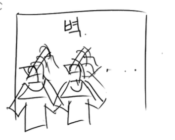
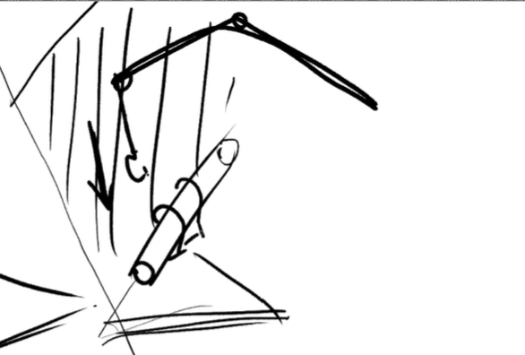
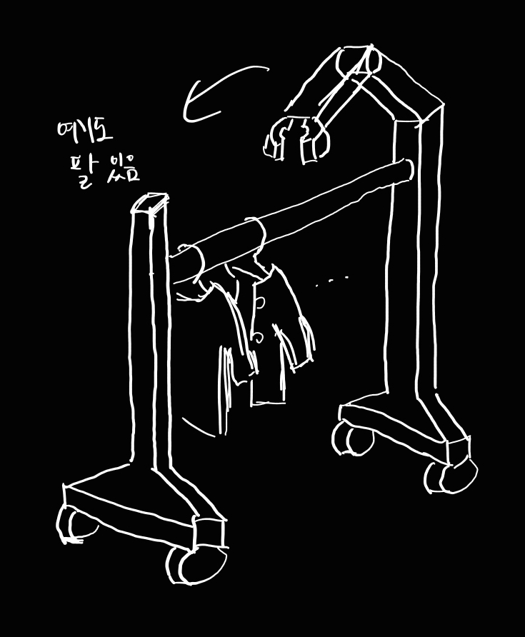
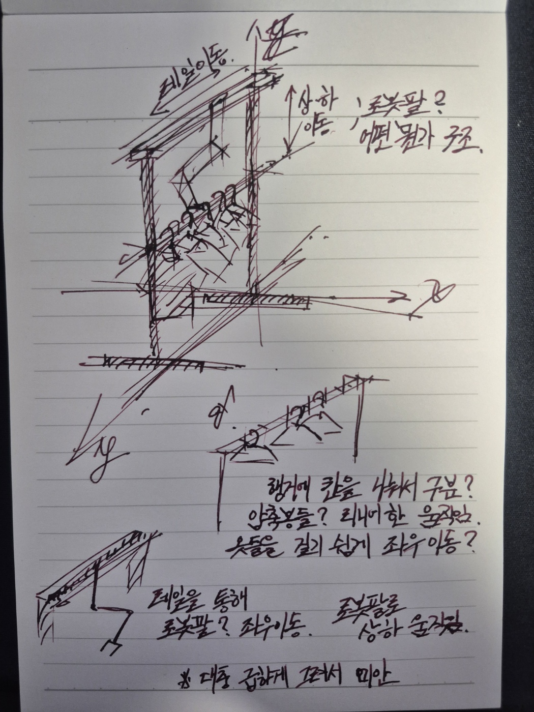
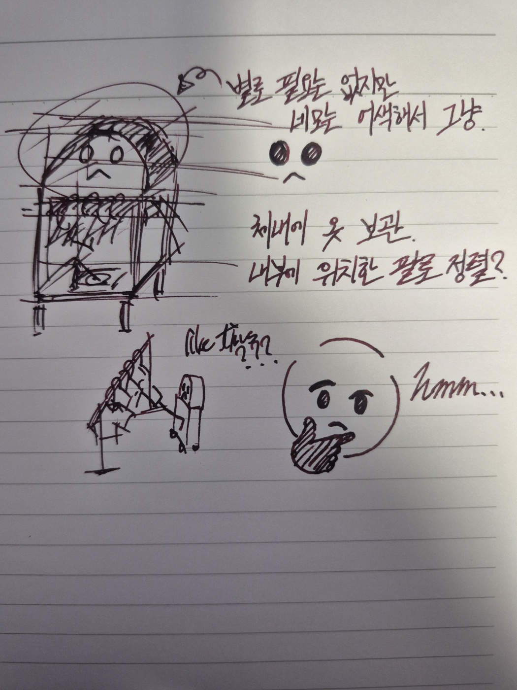
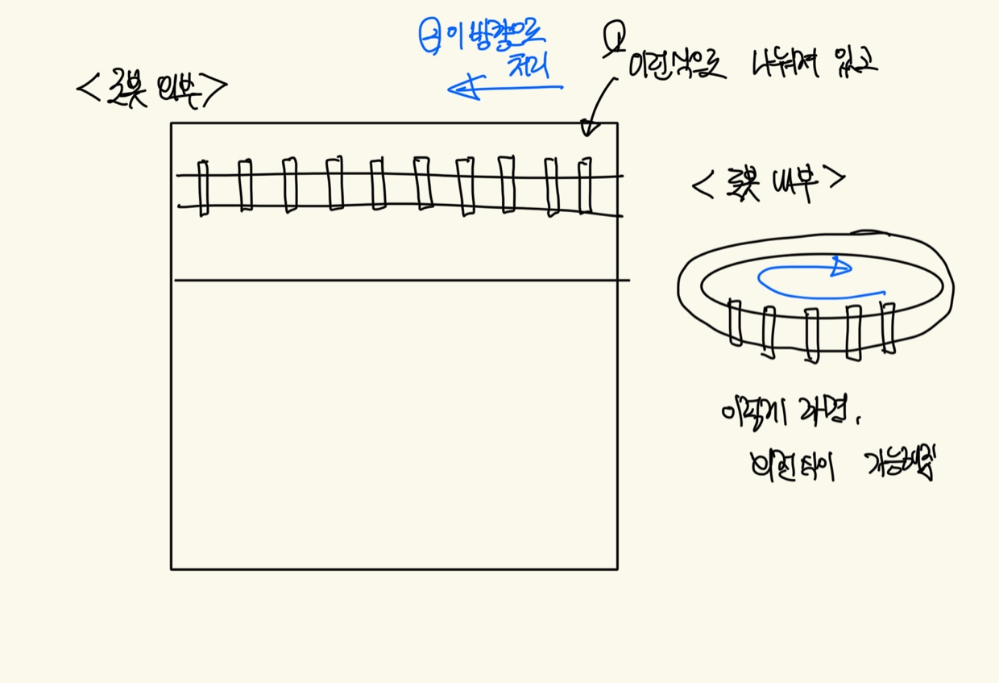
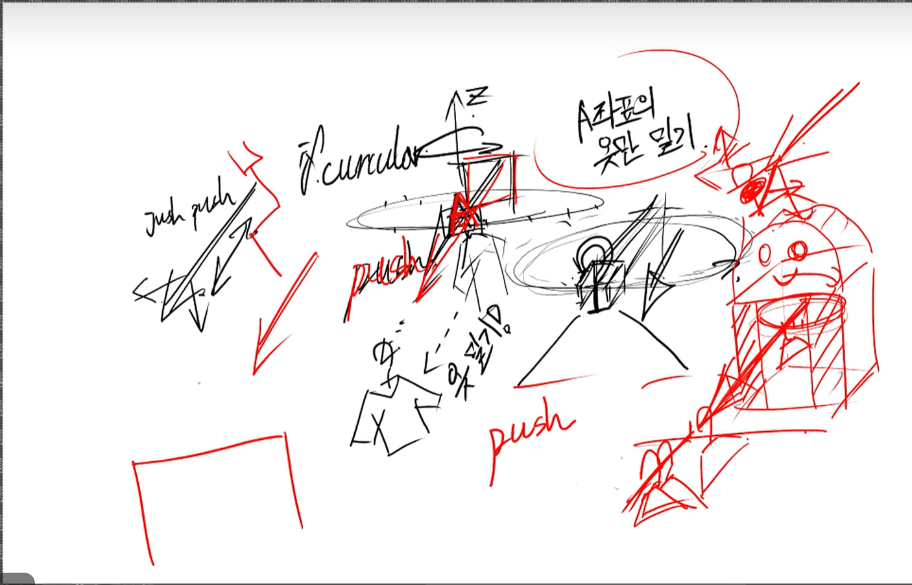

# 선정 아이디어 디벨롭 및 추가 아이디어 브레인스토밍

| 항목    | 내용        |
| ----- | --------- |
| 회의 일시 | 2026.09.10       |
| 회의 장소 | 온/오프라인       |
| 참석자   | 박상원, 곽민지, 김민서, 유지원, 윤대준       |

## 목표

- 옷걸이 아이디어 디벨롭
- 새로운 10개의 아이디어 선정

---

## 전달 사항

### 아이디어 템플릿

1. 문제 의식
2. 아이디어
3. 구체적인 사용 시나리오
   - ex. 사용자, 사용 상황, 문제, 해결 과정, 필요성(장점)
4. 구현 방식
5. 실현 방향성
   - ex. 예상되는 기술적 어려움은?
6. 기대효과 (선택)
   - 실제 사용자에게 어떤 효과가 있는가?
   - 작품을 시연했을 때 어떤 시각적/체감적 임팩트가 있을까?
7. 회의 전 질문 / 의견 (다른 팀원들이 작성)
   - 궁금한 점:
   - 우려되는 점:
   - 추가 아이디어:

### 다음 해야할 일

- 계획서 작성
- 아이디어 drop할 것 검토
  - 작업 모자
  - 타 팀과 비슷했던 아이디어 검토
- 아이디어 돔 시스템부터 검토

### 기존에서 가져올 것

- 특수 마스크를 통해 작업자의 얼굴 체온과 쿨링/온열 온도를 자동으로 맞춤 제어
- 헬멧에 장착된 초소형 카메라가 작업자의 안면 피부 붉은기, 눈 깜빡임 주기, 표정 긴장도를 실시간 분석하여 열 스트레스나 피로도를 수치화

---

## 1. 브레인스토밍 방향

### 배제할 것

- 최근 10년 간 임베과 캡디로 나온 작품
- 스마트팜, 약자 관련 작품
- 데모가 어렵고 임팩트가 없는 것

### 확장 방향 메모

- 이 아이디어의 확장 방향을 생각해보자
- 피험자를 제한하지 말아보자 (조건부 제한 꼼수)

---

## 2. 옷걸이 아이디어 디벨롭

### 자동 의류 분류 및 진열 시스템

옷의 색상과 종류를 스스로 인식한 뒤, 지정된 위치로 자동으로 분리하거나 진열해주는 매장 자동화 시스템.

**고려 사항**

- 분류는 어떻게 할 것인지
- 정리 방식
- 모듈형 / 자체 센서 기능? (버전마다 다름)
- 인식 방식
- 옷을 순차적으로 뺄 것인지 중간에서 뺄 것인지
- 옷을 여러 벌 거는 경우
- 옷걸이에 옷을 잘못 거는 경우 해결
- 실사용자와 피험자 구분
- 옷걸이 센서 맞춤 제작 여부
- 옷 태그 자체 인식 (ex. 유니클로 RFID)
- 매장마다 디스플레이가 다른 상황을 고려한 디지털 트윈 구현
- 옷을 거는 시나리오
- 옷을 잘못 걸었을 때 정리를 할 것인지 (→ 사람이 하는 게 나을 수도)
- 서빙 로봇의 모드 전환
- 행거 자체 이동 / 행거 자체의 센서 기능
- 매핑 기능
- 행거 형태에 따른 옷의 하중
- 재고 관리
- 옷의 위치 구성 기준
- 상황 특화: 기존 것으로부터 파생

### 종류별 아이디어

#### 문제와 추상적 해결책

> 민지: 진열 오류나 반납 옷들 걸기를 모두 목적으로 가져가는 것보다, 우선적으로 해결할 목적을 설정하는 게 좋지 않을까…

⇒ 아래 후보 장면에 더 추가하여 **"문제 상황(우리가 택한 현재 구조의 문제) → 시스템 개입 시나리오"** 이 흐름대로 작성

⇒ 발표 시: ~이런 문제들이 있고 그중에 우리가 목표로 삼은 문제는 어떤 것이며, 그에 대한 해결책으로는 ~이런 수많은 방식들을 생각해보았다.

**후보 1: 피팅룸 반환 의류 정체 문제**

- 문제 상황: 대형 의류매장에서 손님들이 피팅룸에서 옷을 갈아입고 벗어둔 옷들을 별도 인력이 회수할 때까지 무작위로 쌓여있음. 특히 주말/세일 기간처럼 손님이 몰리는 시간대에는 반환량이 급증해 정리 인력이 따라가지 못하고, 그 사이 매대에는 재고가 비어있는 것처럼 보여 판매 기회 손실로 이어짐
- 추상적 해결책: 손님이 옷을 벗어두는 "대기 지점"과 로봇이 자동으로 인식·수거하여 원래 진열 위치로 되돌리는 "회수-분류-재진열" 흐름을 자동화. 사람의 개입 없이 상시 순환되는 구조를 만듦
- 기대효과: 재진열 소요시간 단축, 성수기 인력 부담 완화, 매대 품절 인상 감소
- 데모 적합성: ★★★★★ — 지금까지 설계한 도킹·이송·그리퍼 요소를 그대로 시연 가능. 소규모(대기행거 1~2개, 목적행거 2~3개)로도 전체 흐름을 보여주기 쉬움
- 구체적 문제 시나리오: A직원이 계산을 마치고 5~10분 뒤에야 대기 행거를 확인한다. 8벌을 색상·종류별로 눈으로 구분하며 하나씩 원래 매대로 나른다. 이 사이 다른 손님이 매대에서 "이 티셔츠 M사이즈 있나요?"라고 묻지만, 사실 그 M사이즈는 지금 대기 행거에 걸려있는 채로 방치 중이다 — 시스템상으로도, 실제로도 "당장 살 수 없는 재고"가 되어버린다
- 해결 시나리오: 사람의 개입이 어디부터 어디까지 될 것인지에 대한 후보군들 적기…

**후보 2: 진열 오류로 인한 고객 경험 저하 문제**

- (⇒ 이건 좀 더 재고 확인 느낌으로 가면 좋을 듯 / 참고: [디시인사이드 글](https://m.dcinside.com/board/mf/765089))
- 문제 상황: 사람이 수작업으로 정리하다 보면 색상/사이즈가 다른 매대에 잘못 걸리는 실수가 발생하고, 손님은 원하는 옷을 찾지 못해 이탈하거나 직원에게 문의가 몰림
  - 혹은 손님이 옷을 잘못 걸어 진열 오류 발생
- 추상적 해결책: 사람의 판단이 아니라 인식 기술(색상/종류 자동 판별)로 진열을 표준화하여 오류 자체를 원천적으로 차단
- 기대효과: 진열 정확도 상승, 고객 탐색시간 감소, 직원 문의 응대 부담 감소
- 데모 적합성: ★★★☆☆ — "오류가 없다"는 걸 보여주려면 비교 대상(사람이 정리한 결과 vs 로봇이 정리한 결과)이 필요해서 연출이 약간 번거로움
  - 살짝의 끼워맞추기 느낌이 날 것 같아서 적합성을 낮게 적었음
  - 사실 2번 상황은 옷가게에서는 적용이 안 되고 있지만, 대형 물류 센터 기계 중에 진열 오류 찾는 기계가 있는 걸로 알고 있음

**후보 3: 시즌/프로모션 전환 시 야간 진열 교체 부담**

- 자라는 2주 간격으로 신제품이 나온다길래 추가한 문제 (참고: [YouTube Shorts](https://youtube.com/shorts/PYeJ9OtHMrc?si=8_ypxvAvJymkemT1))
- 문제 상황: 시즌 변경이나 대규모 세일 시작 전날 밤, 매장 전체 진열을 통째로 갈아엎어야 함. 짧은 시간(보통 폐점~익일 오픈 사이) 안에 수백~수천 벌을 새 기준으로 재배치해야 해서, 야간 인력이 집중 투입되고 오픈 시간을 못 맞추는 경우도 발생
- 추상적 해결책: "여름 컬렉션 → 가을 컬렉션"처럼 새 진열 기준을 입력하면, 로봇이 야간 동안 대량의 옷을 자동으로 새 위치에 맞춰 재배치
- 기대효과: 야간 인력 투입 감소, 교체 소요시간 단축, 정시 오픈 준수율 향상
- 데모 적합성: ★★★★☆ — "교체 전 진열 → 교체 후 진열"을 나란히 보여주는 전후 비교 연출이 시각적으로 강력함

**후보 4: 매장 내 산발적 의류 방치 문제**

- 문제 상황: 손님이 여러 벌을 집어 들고 둘러보다가, 마음이 바뀌면 원래 매대가 아닌 아무 곳에나 내려놓고 감(다른 매대 위, 계산대 근처 선반, 심지어 바닥 근처 벤치 등). 피팅룸 반납이나 반품처럼 "정해진 반납 지점"이 없어서, 옷이 매장 전역에 무작위로 흩어져 방치됨. 직원이 순찰하며 일일이 찾아내 제자리로 돌려놔야 하는데, 방치 위치를 예측할 수 없어 발견 자체가 늦어짐
- 추상적 해결책: 고정된 수거 지점에 의존하지 않고, 로봇이 매장을 순찰하며 손님이 그 자리에서 바로 건네는 옷을 즉석에서 받아 인식·재진열하는 흐름을 만듦. "반납 지점을 만드는 것"이 아니라 "반납 지점을 없애고 로봇이 어디든 따라다니게" 하는 접근
- 기대효과: 무작위 방치로 인한 재고 발견 지연 해소, 직원의 매대 순찰 부담 감소, 방치된 옷 때문에 발생하는 매장 미관 저하 방지
- 데모 적합성: ★★★☆☆ — "로봇이 사람에게 다가가 옷을 직접 수령"하는 상호작용 자체는 인상적인 장면이 되지만, 순찰 경로/사람 발견 인식 등 추가 기술 요소가 필요해서 지금까지 만든 도킹 중심 파이프라인만으로는 부족함
- 구체적 문제 시나리오: 손님 서연 씨가 니트 3벌, 바지 2벌을 들고 매장을 둘러보다가, 계산대 앞에서 "역시 이 색은 안 어울리네" 하며 니트 1벌을 계산대 옆 진열 스탠드 위에 아무렇게나 올려두고 나간다. 정작 그 스탠드는 완전히 다른 카테고리(액세서리) 진열대다. 순찰 중이던 직원이 그 자리를 지나기 전까지, 이 니트는 몇 시간이고 엉뚱한 곳에 방치된다

#### 정리

**사전 정렬하는 경우**

- 사람이 미리 같은 카테고리(넓게는 그 근처 구역)끼리 분류
  - 행거 교환(또는 탈부착)
    - 탈의실 앞에서 사람이 정렬하고 있는 행거
    - 로봇에 붙어서 정리되러 가는 정렬된 행거
  - IF 교환 방식 - 방식 생각 정도: 행거 자체가 통째로 탈부착?
    - 이미 옷이 있는 매대에 대해 정리를 위해 옷을 넣는다면? 교체식이면 원래 옷들은?
    - 탈의실 앞쪽 1차 정렬된 행거와 빈 행거 교체 (탈의실 용)
    - 이동식 행거의 형태 (외부 행거를 들고 다니는 형식)
      - 우려점 1) 사람이 혼잡할 때 이동 방식 우려
      - 우려점 2) 사람들이 로봇에 꽂았을 때 재정렬해야 하는 문제점
      - 해결) 행거 자체에 캡이나 차단막이 필요할 것 같다. 단, 용도를 모르는 사람은 정상 프로토콜로 사용 X → 로봇이 다닐 수 있는 백도어나 경로 필요 → 사전 정렬 없는 경우로 연결
    - 로봇 자체 행거의 위치: 내부 행거 OR 행거가 고정이고 로봇팔이 거는 방식?
  - 탈의실 앞쪽에 따로 사전 정렬 시스템 (옷 종류가 정말 많아지는 경우)
    - 메인 레일(행거)만 사람이 변경
    - 참고 이미지: 메인 레일(옷걸이 이동) → 인식 센서(색상/종류 판별) → 분기점(스위치)에서 존별로 분기

      ```mermaid
      flowchart LR
          A[메인 레일<br/>손님이 걸어둔 옷걸이] --> B[인식 센서<br/>색상/종류 판별]
          B --> C{분기점<br/>스위치}
          C --> D[티셔츠 존]
          C --> E[바지 존]
          C --> F[자켓 존]
      ```

**사전 정렬 없는 경우**

- 여러 벌 중에 단 한 벌만 인식이 가능하다면 이동 비효율 발생 가능
  - 매번 다른 곳에 있는 경우 이동 비효율
  - 다익스트라나 A\*처럼 모든 옷을 통해 최단경로를 구하는 건 쓸모 없을 수도
- 아래 방법론 필수 — 어떤 옷을 옮겨야 하는가 기준

  **로봇이 가지고 있는 옷 중 옮겨야 하는 옷을 선택하는 방법론**

  - 로봇팔 끝에 리더기를 붙이자! (정확도 확인 필요)
  - 한쪽 끝에 RFID 리더기를 붙여 가장 가까운 옷 선택
    - RFID 거리 구분 관련 (요약: 간단한 거리 구분 정도는 가능)

      | 방식 | 정확도 | 비용/복잡도 |
      | --- | --- | --- |
      | RSSI만 사용 | 낮음 (대략적 원근 구분) | 낮음 |
      | 위상 기반 | 중~높음 (cm 단위 가능) | 중간 |
      | 다중 안테나 삼각측량 | 높음 | 중간~높음 |
      | UWB 병행 | 매우 높음 | 높음 |

      1. **RSSI 기반 거리 추정 (가장 흔한 방식)**: RFID 리더가 태그로부터 받는 신호 세기(RSSI)를 측정해 신호가 강할수록 가깝다고 판단. 구현이 간단하고 추가 하드웨어가 거의 필요 없지만, 장애물·다중경로 페이딩·태그 방향·주변 금속/수분 등에 크게 영향받아 오차가 수십 cm~수 m 수준. "가깝다/멀다" 정도의 대략적 순위 구분에만 사용.
      2. **위상 기반 거리 측정 (Phase-based Ranging)**: UHF RFID에서 신호의 위상 변화를 분석해 훨씬 정밀한 거리 계산 (FM-CW와 유사한 원리). RSSI 대비 정확도가 크게 향상되어 cm 단위 구분도 가능하나, 리더·알고리즘이 복잡하고 비싸며 다중경로 환경에서는 여전히 오차 발생.
      3. **Time of Flight (ToF) / UWB 결합 방식**: 일반 RFID는 대역폭 부족으로 ToF 기반 거리 측정이 어려워, 정밀 거리 측정이 필요하면 UWB(Ultra-Wideband) 태그를 쓰거나 RFID와 UWB를 결합한 하이브리드 시스템 사용. UWB는 나노초 단위 펄스로 ToF를 정밀 측정해 cm 단위 정확도.
      4. **다중 안테나/리더를 이용한 삼각측량 (Triangulation)**: 리더 하나로는 "얼마나 가까운지"만 알 수 있고 방향은 알기 어려움. 여러 안테나·리더를 다른 위치에 배치해 각각의 RSSI/위상 값을 조합, 삼각측량으로 태그의 정확한 위치를 계산 — 실내 위치추적(indoor positioning) 시스템의 표준적 접근.

  - 전용 옷걸이가 있다면 카테고리에 맞는 옷걸이 선택 (옷걸이 제약 있음)
  - 카메라 있는 로봇팔이 달린다면, 옷의 유사도 체크를 통해 선택적으로 옮길 수 있지 않을까
  - 결과적으로 정렬 없이 현재 지니고 있는 옷들에 대해 움직이면서 하나씩 넣는다는 의미

**로봇 → 행거 (이동 방식)**

- 로봇팔
  - 최소 1개의 로봇팔이 옷걸이를 들어 옮김
  - 원래 행거에 이미 옷이 빽빽하다면
    - 가장 끝 쪽 옷에서 들이밀기
    - 틈을 만들고 끼워넣기
- 슬라이딩
  - 원래 행거와 로봇의 행거를 연결 후 행거를 기울여 옷 이동
  - 행거의 한쪽 끝이라도 연결 가능해야 함
  - 행거 연결을 위한 인식 방법: 행거끼리의 센싱 / 비전

**행거 형태의 구분 (앞에서 봤을 때)**

- 1열 형태 (예: `ㅏjㅡjㅡjㅡjㅡjㅡjㅡjㅓ`)
- 벽면 형태 (예: `ㅣiㅣiㅣiㅣiㅣ`)
    

#### 로봇 자체 행거의 위치

- 우려점: 옷걸이를 어떻게 잡을 수 있을까? / 행거를 거는 틈이 있을까?
- 밀기 형식으로 틈을 걸 공간을 창출하는 방법
- 옷걸이 목이 긴 경우 / 짧은 경우 고려 필요
- 집게 형태

  - 기존 옷걸이 형태에도 적용 가능하도록 후크 형태로 위에서 걸어서 내려놓는 방식 (2축: 수평 위치 + 수직 하강)
  - 단, 양쪽 옷을 벌리는 별도 장치가 또 필요
  - ⇒ 그리퍼 형태와 후크 형태가 둘 다 가능하도록 위에서 로봇팔이 내려오는 형태
- 우려점: 운송 중 옷걸이가 흔들리는 경우 → 양쪽 옷을 벌리는 장치가 필요
- cf. 로봇 형태는 아니지만 행거에서 정렬한다면? (아래 "행거 내부/외부 차이점" 참고)

**행거 장착 방식 (내부/외부)**

1. 행거가 밖에 있어서(=고정 위치), 로봇 내부에 장착하는 형식으로 작동할지
   - 장착 형식이라면, 어떻게 고정을 시킬 것인지
2. 탈의실의 옷 정리
   - 탈의실 앞에는 대기 행거가 있어야 함
   - 로봇은 대기 행거에서 가져와서 나르는 형식으로 생각 (탈부착 형식)
   - 로봇 안의 행거는 고정 형식? 장착 형식?
   - 행거가 외부에 있어 전환이 가능할 때는 행거 고정을 어떻게 시킬지
   - 로봇 안에 행거가 있어도 탈부착이 되는 형식을 기본으로 함

- 행거가 로봇 안에 있으면, 탈의실 앞에 로봇이 계속 있는 형태인지 → 로봇이 계속 움직일 수 없다는 이동 비효율성 문제
- 행거의 위치에 따라 로봇이 움직일 수 있을지 없을지가 갈림
- 무엇을 해결하고자 하는지: 옷의 정리 방법, 옷의 진열 위치를 찾는 것
- 로봇팔이 어떻게 효율적으로 한 행거의 옷을 한 번에 가져갈 수 있을지 → 로봇 내부의 원형 방식이 돌면서 처리
- 팔이 리니어 역할뿐 아니라 3축 역할까지 한다면? → 공간 문제, 기능 분리 필요
  - PUSH는 PUSH만 (정렬 기능) — 옷걸이가 얇은 문제가 있음
  - 정렬하는 부분과, 행거 중간에 양옆 공간을 창출하여 미는 형태를 구분

**행거 내부/외부 차이점**

- 사람이 중간에 거는 경우를 고려했을 때, 외부라면?
- 정리의 기준: 옷이 행거에 모두 걸려있을 때 사전 정렬
- 계속 돌아다니는 로봇의 경우, 맨 앞에만 있는 것을 처리하는 방식이 좋을 수 있음 (단, 옷걸이 칸이 한정됨)
- 로봇 외부: 로봇 바깥에 있는 경우 (슬라이딩 방식으로 처리) — 앞에 있는 것을 기준으로 처리
- 로봇 내부: 로봇 안에서 이뤄지는 경우, 탈부착 형식 X
- 동그라미 행거 형태

**예시 그림**






#### 인식

**가져 놓아야 할 옷이 무엇인지 알기 위한 인식**

- RFID 인식 장치 활용
- 이미지 센서 활용 (바코드를 읽든, 상품명을 읽든)
- 여러 벌이라면 어떤 순서로 걸려 있는지도 알 수 있으면 베스트

**옷의 도착지를 위한 인식**

- 매장 어디에 옷이 있는지 데이터베이스 필요
  - 옷이 어떻게 분류되어 있는지 바뀔 때마다 사람이 직접 입력
  - RFID 인식 장치를 원래 행거에 장착하여 카테고리 자동 인식
    - 이 위치를 정확히 표현할 수 있는, RFID 외의 추가 수단이 필요할 것 같음

**도착지의 위치를 위한 인식**

- 자체 데이터 활용
  - 로봇의 이동을 위한 지도가 있을 텐데, 위의 인식을 이 지도에 연동하면 로봇이 가지고 있는 옷만 인식하면 바로 이동할 수 있을 것 같음
- 행거에 무언가 부착된다면
  - Wi-Fi
  - Zigbee
  - BLE

**도착 후 행거 인식**

- 비전(카메라)
- 다른 방법?

**인식 (분류)**

- 로봇: 로봇에 부착된 RFID/비전 센서
  - 실행/이동
  - 옷 무게/부피 처리
- 행거 자체 센서형: 행거 레일/봉 자체에 내장된 센서
  - 인식/재고 관리

**인식 단계**

1. 옷 식별: RFID 태그(다중 태그 동시 인식 O) / 비전 카메라
2. 분류 기준 매칭: 미리 입력한 DB에 저장된 카테고리와 RFID 매핑 / 이미지 학습 모델
3. 목적지 매핑: 구역별 RFID 설정 (매대 상품이 바뀌는 시즌 변경 시 DB 갱신 필요)
4. 도착 확인: 도착지 행거의 RFID 재스캔 / 비전으로 최종 확인
   - 행거 봉 자체에 내장된 RFID 리더가 스캔하고, 잘못 걸리면 경보음이 나거나 중앙 서버에 반영

#### 예상 시나리오

**이상 시나리오**

- 손님이 행거에 옷을 잘못 건 경우
  - 행거 자체의 센서 인식 기능 — 옷(옷걸이/바코드)과 행거의 센서가 일치하는지 비교하여 서버에 알림
  - 서빙 로봇의 전환 모드 (한적하거나 할 일이 없으면 스캔 모드로 전환하여 이상 진열 감지)
- RFID 태그 인식 실패 (신제품 미등록, 금속 부자재의 간섭)
  - 1차 RFID 실패 시 비전(바코드/이미지 분류) 보조 인식
  - 둘 다 실패하면 임시 분류함으로 이동 후 직원 호출 등 알림
- 목적지 구역의 행거가 이미 꽉 찬 경우
  - 도착 전 비전/행거 센서로 여유 공간 사전 확인
  - 임시 보관 구역 운영
- 매장 혼잡: 로봇 이동 중 장애물(고객, 카트)을 맞닥뜨린 경우
  - 서빙 로봇 모드 전환 (정지 → 우회 경로 재탐색)
- 한 벌만 인식되어야 하는데 여러 벌이 한 번에 RFID 리더에 잡힘 (사전 정렬 없는 경우)
  - 비전으로 이전에 가장 앞에 있던 옷의 형태를 대조하고, 그래도 불확실하면 가장 앞쪽 하나를 디폴트로 선택하는 등 고정 상황 설정
- 반납한 옷의 상태 차이
  - 실험 설계 때 정상 반납 테스트 케이스와, 등록되어 있지 않은 반납의 경우를 나누어 케이스를 쌓아감
    - ex. 옷이 뒤집힌 채로 반납된 경우, 구김 정도가 심한 경우, 옷의 형체(너무 흐물거리는 옷) 등
  - 옷걸이에 옷이 잘못 걸림 (뒤집힘, 다른 옷과 얽힘) → 직원 호출 알림만 발생시키고 진열 보류

**여러 벌 동시 처리**

- 상황: 로봇이 한 번에 5벌을 픽업했고, 각기 다른 3개 구역으로 나눠 배치해야 함
- 동작: RFID로 5벌 전부 식별 → DB 매핑 → 구역별로 그룹화(3개 그룹) → 로봇 최단 이동 경로 계산 → 각 구역 도착 시 "그 구역에 해당하는 옷만" 선택적으로 분리(로봇팔 또는 슬라이딩 시 해당 태그가 리더기(행거?)와 가장 가까운 옷 우선 인식)하여 거치

**행거 자체 센서형을 이용한 재고 자동 갱신**

- 상황: 고객이 매대에서 옷을 집어가거나, 직원이 다른 곳에서 옷을 옮겨와 임의 행거에 걸어둠
- 동작: 행거 봉에 내장된 RFID 리더가 주기적으로(예: 30초 간격) 스캔하여 재고 변화를 감지 → 중앙 서버에 실시간 반영
  - 특정 구역 재고가 임계치 이하면 디피 필요 등 알림 발송

---

## 3. 새 아이디어 선정

### 3-1. 페인팅 로봇

- 건물 외벽 페인팅
- 원하는 벽 위치에 대해 도색 / 스프레이
- 불법 그래피티 재도색

**할 일**

- 벽을 어떻게 움직일 것인지 조사 필요 (와이어? 흡착식? 유리창 로봇처럼?)
- 이 상황 외에 다른 곳에서도 구상 아이디어를 사용할 수 있을지 검토
  - 불법 그래피티 AI 자동 탐지 + 원색 복원
  - 실내 인테리어용 소형 로봇 (화분의 PTSD… 라는 의견 있었음)
  - 벽면 결함 검출 및 스팟 페인팅 유지보수 로봇 — 카메라로 벽면 상태 진단 후 필요 부분만 스캔
  - 벽지 시공 (페인팅뿐 아니라)
  - 내부 인테리어 하자 체크용 (타일 들뜸, 벽지 미시공 등 촬영 → 데이터화)
- 벽에 대한 일반화가 어렵다면 대상 벽 범위를 좁혀야 함 (내부 인테리어용? 외장? 콘크리트벽, 벽돌벽, 타일, 원목, 대리석 등)

**기존 유사 사례 조사**

- [하이테크플러스 기사](https://www.hapt.co.kr/news/articleView.html?idxno=157177) — 와이어 방식, 스프레이+롤러 하이브리드
- [연합뉴스 기사](https://www.yna.co.kr/view/AKR20250520049800003) — 와이어 수직 이동 + 롤러 도장
- [tech42 기사](https://www.tech42.co.kr/) — 팬 추력 방식, 고무바퀴 4개 + 팬 2개로 벽 밀착, 평면/곡면/천장 이동, 6kg 탑재
- 참고: [roboprint.co.kr](https://www.roboprint.co.kr/default/02/05.php?topmenu=2&left=5), [irobotnews 기사](https://www.irobotnews.com/news/articleView.html?idxno=30706)

---

### 3-2. 완충재 가변 투입 및 상자 맞춤형 테이핑 서비스

**문제 의식**

1. 중소 규모 물류 센터, 소상공인 공간 타겟
2. 작업 피로도 감소, 포장 시간 단축 — 친환경 경영 확산으로 종이 완충재 수요가 급증하나, 손으로 구기거나 알맞은 장력으로 가공해 넣는 수작업이 포장 속도를 현저히 떨어뜨림
3. 상품 스캔부터 개별 포장, 박스 크기 선정, 완충재 충전, 테이핑까지 전 과정을 로봇으로 자동화하기엔 비용 부담이 크므로 부담을 줄여주는 방향으로 설계

**아이디어**

- 완충제별 해결 방법 (폼 형태, 옥수수 완충재, 종이 완충재)
- 일반적인 상품 포장 시퀀스: 상품 확인 → 완충 포장 → 박스 포장 → 서류 동봉 및 테이핑 → 송장
  - 개별 포장(1차 포장, 비닐/뽁뽁이)은 로봇화가 어려워 완충 포장 단계부터 고려
  - 박스에 넣고 완충재 충전, 테이핑까지는 해볼 만함
- 전체 목적: 완충제 종류만 정하면 됨 (테이핑은 이미 존재하는 기능)
  - 옥수수 충전재: 박스 높이까지 채우는 관 (비교적 쉬움)
  - 종이 완충제: 장력 조절이 관건
- 거대한 컨베이어 벨트 대신 1인 작업대(Desk-scale) 크기로 축소
- 내부 물품의 종류/깨지기 쉬운 정도를 인식하여 완충제 투입량 및 위치 변경 (단, 물체를 움직이는 추가 장치 필요)

**유사 사례 조사**

- [Crown Packaging 유튜브 영상](https://www.youtube.com/watch?v=fcIqsZQb8Do) — 테이핑은 없지만 완충제 채우는 기계 존재
- [Ranpak Autofill](https://www.ranpak.com/automated-solutions/autofill/) — 테이핑까지 하는 기계 있으나 사이즈가 매우 큼
  - 무게 약 1.73톤, 크기 8.88m × 1.89m × 2.55m
  - 처리 가능 박스: 최소 20.3×15.2×10.2cm ~ 최대(옵션) 76.2×76.2×72.4cm, 최대 상자 무게 약 22.7kg
- 참고: [CPACK 반자동 포장 테이블](https://www.cpackltd.com/products/giftwrap-semi-auto-mini)

---

### 3-3. 오프라인 마트용 매장 내 자율 장보기 로봇

- 목적: 공장형 마트는 이미 자동화가 도입되어 있으므로, 오프라인(아직 미도입) 대상으로 설정
- 오프라인 쇼핑자의 니즈는 신선도 직접 확인 — 그 외는 자동화
  - 앱 장바구니에 물건을 담으면 카트와 연동되어 자동으로 담아줌
- 계산대에서 리스트업만 하면 자동으로 매대에서 물건을 담는 방식
  - 매대에서 앱과 상호작용해 리스트를 생성하는 방식도 고려
- 배달의민족 마트 장보기와 유사한 컨셉 + 새벽 배송과 같은 빠른 배송 기능

**할 일**

- 추가 자료 조사 필요
- 파고들 만한 틈새 시장 탐색

**참고 자료**

- [YouTube 영상 1](https://www.youtube.com/watch?v=t0KF9upglM8) — 사람(장애인) + 로봇팔 형태
- [YouTube 영상 2](https://www.youtube.com/watch?v=XWlQWgRfh6c&t=2s) — 공장형 사례
- [NVIDIA 블로그 (Telexistence 편의점 로보틱스)](https://blogs.nvidia.co.kr/blog/telexistence-convenience-store-robotics/)

---

### 3-4. 다층 매장 카트 밸런스·자율 회수 시스템

- 제자리 반납이 잘 안 되는 문제 → 사용하지 않는 것이 확인되면 알아서 원래 자리 또는 가까운 보관소로 이동
- 반납된 물건 정리 자동화 / 카트 제위치 반납
- 몰아져 있는 카트를 한 번에 이동 (하부에 로봇을 두는 방향 등)
- 무단 반출 관련 (마트 외부 방치, 도난 등)은 후순위로 검토

---

### 3-5. 마트 반납 물품 자동 반납 서비스

- 계산대나 매장 어딘가에 두었던, 사지 않아 다시 가져다 둬야 하는 물건 처리
- 손님이 중간에 물건을 넣어도 되고, 나중에 계산대 물품도 회수해서 가져다 둘 수 있음
- 추가 아이디어: 상온 공산품은 트레이가 찰 때까지 모아서 출발하되, 냉장·냉동식품이 감지되면 즉각 우선순위 큐(Priority Queue)를 실행해 해당 구역으로 최단 경로 주행

---

### 3-6. 전기차 번호판 미인식 해소 CCTV 시스템

**문제 의식**

- 핵심 문제: 재귀반사 필름형 번호판이 만드는 과노출 식별 실패
- 전기차 번호판(연한 하늘색, 필름 재귀반사 소재)은 낮은 각도에서 강한 광원을 받으면 카메라 센서에 빛이 그대로 튕겨 들어와 글자 영역이 하얗게 날아가는 과노출 현상이 발생
- 기존 금속 번호판 대비 반사율이 훨씬 높아, 동일한 촬영 환경에서도 전기차만 유독 식별 실패율이 높음 — "전기차 확산"이라는 시대적 흐름과 충돌하는 사각지대
- 블랙박스에만 국한되지 않는 문제
  - 블랙박스: 뺑소니·사고 입증 실패
  - 주차장 LPR(차단기 입출차 인식): 야간·지하주차장 저조도+플래시 환경에서 오인식 → 출입 지연, 요금 오청구
  - 도로 ITS/과속·방범 CCTV: 실제 위반 차량 식별 실패
- 카메라-번호판 인터페이스 자체의 구조적 문제로 재정의

**아이디어**

1. 하드웨어: 모터 구동형 편광 필터
   - 카메라 렌즈 앞에 전동 회전 편광 필터를 모듈형으로 부착
   - 광원 각도·차량 진입 각도가 매번 달라지므로, 고정 편광각이 아닌 실시간 모니터링으로 최적 반사 차단 각도를 자동 탐색하는 소형 모터 제어 설계
2. 소프트웨어: 과노출 영역 AI 복원
   - 편광 필터로 1차 저감 후에도 남는 과노출은 AI OCR 보정으로 2차 처리
   - 원본 데이터가 아예 없는 경우엔 한계점 존재

**기대효과**

- 방범 CCTV·과속단속 카메라의 전기차 오인식률 개선
- 블랙박스 사용자: 야간 접촉사고·뺑소니 발생 시 상대 차량(특히 검정/파랑 전기차) 번호판을 실제로 읽어낼 수 있음
- 시연 임팩트: 회전 모터가 실시간으로 최적각을 찾아가는 모습, "일반 번호판 vs 전기차 필름 번호판"을 같은 조명 조건에서 촬영 비교 시연

**확장 방향 (할 일)**

- 블랙박스에 제한하지 않고 CCTV 등으로 확장 (주차장 입출차 차단기 및 LPR, 도로변 방범·과속 단속 CCTV/ITS)
- 소프트웨어 보정만으로는 한계가 있어 모터로 각도가 조절되는 편광 필터를 장착하는 방향으로 정리

---

### 3-7. 수액 역류 방지 및 자동 긴급 클램프

- 목적: 사용자·보호자가 부재하거나 통제할 수 없는 상황 예방 + 병원 인력 효율화
- 센서 기반 수액 자동 차단 및 간호사 인력 송출 시스템
- 이상 상황 발생 시 즉각적인 물리적 차단(클램프 작동)과 맞춤형 의료진 호출을 연동해 사고 확산을 조기 방지
- 간호사가 모든 병상을 눈으로 순회하지 않아도 되는 우선순위 기반 대응 체계

**문제 의식**

- 병원은 구조적으로 보호자도 없고 간호사도 상시 붙어있을 수 없는 병상 공백 시간이 반드시 존재함
- 한국 간호사 1인당 담당 병상 수는 OECD 평균 대비 훨씬 많음 (야간 근무 시 더 심함) → 실시간 감시 물리적으로 불가능
- 공통 구조: 이상 신호 발생 → 사람이 발견하기까지의 시간이 사고의 크기를 결정 → 이 latency를 줄이는 것이 핵심
- 병상 이상징후 감지 + 즉각 물리적 개입 + 인력 호출이라는 하나의 플랫폼 로직 (수액이 아니어도 무방)

**구체적 사용 시나리오**

- 수액 라인 거치대에 장착된 소형 AI 카메라(YOLO)가 수액 방울의 낙하 속도, 잔여 액체량, 튜브 내부 공기 유입 및 역류 징후를 24시간 실시간 모니터링
- 수액이 다 떨어져 가거나 역류·기포 발생 위험이 감지되는 즉시, 수액 실리콘 튜브를 완벽하게 짓눌러(Clamp) 액체 흐름을 원천 차단
- 해결 과정: 동시에 간호스테이션에 우선순위 알림(병상 번호, 이상 종류, 심각도 포함) 전송

**추가 아이디어 (센서 관련)**

- 정밀 센싱(로드셀 + 압력 센서): 수액 잔량 무게와 함께 라인 내부 압력 변화를 실시간 모니터링하여 역류 조짐이나 막힘 감지
- 임베디드 로직 및 자동 제어: 잔량 10% 미만이거나 역류 압력이 감지되면 소형 솔레노이드 밸브 또는 스테핑 모터 기반 물리적 튜브 클램프를 즉시 작동

**할 일**

- 문제 의식 관련 추가 문제들을 더 찾아본 뒤 공유하여 묶을 수 있는 문제끼리 묶기

---

### 3-8. 안면 진단 및 괄사 케어 (온도 조절)

안면 부종과 근육 긴장도를 측정해, 괄사의 온열 및 쿨링 온도를 맞춤 제어하여 혈행을 돕고 안면 피로를 완화하는 장치.

**아이디어**

- 사용자가 문지를 때 괄사 본체의 압력 데이터를 거울 화면(또는 앱)에 실시간 게이지로 표시
- 적정 압력 범위를 벗어나면 괄사 본체가 햅틱 진동으로 "너무 세게 누르고 있습니다" 경고
- 괄사 온도 / 괄사 형태 변형 / 혈자리 관련 추가 검토

**문제 의식**

- 기존 제품은 모두 수동 도구이며 매번 동일한 방식으로 사용

**구체적 사용 시나리오**

- 전일 대비 얼굴 좌우 비대칭·붓기 변화 트렌드를 시각적으로 트래킹(상대 비교 데이터 수집)
- 해결 과정: 디바이스가 "오늘은 어제 대비 우측 볼 부기 증가 감지 → 쿨링 5분 후 온열 3분 추천" 형태로 안내 → 사용자는 안내에 따라 괄사 사용
- 필요성/장점: 데이터 기반 맞춤 케어로 바꿔주는 경험 자체가 차별점, 매일 축적되는 얼굴 변화 기록이 부가가치(추이 확인, 컨디션 관리 습관화)로 이어짐

**할 일**

- 아이디어 방향을 좀 더 구체화

---

### 3-9. ANC 기반 수면 돔 + 공기청정기

- 엣지 AI가 주거지의 소음 패턴(새벽 오토바이 소리, 아침 공사장 소음 등)을 학습하여, 소음이 들어오기 직전에 역위상 파형을 준비하거나 부드러운 백색소음으로 치환해 청각적 충격 완화
  - "우리 집 소음을 학습하는 AI 마스킹" 또는 "무슨 소리가 나는지 AI가 알아채고, 방 안에서 덜 거슬리게 편안한 소리의 볼륨·톤을 실시간 조절해 덮어버리는" 사운드 마스킹 기술
- 성인을 위한 모기장 형태의 숙면 침대 (돔 형태) — 물리적 밀폐 구조로 1차 차음
- 세미/간이 방음부스 컨셉
- 누웠을 때 볼 수 있는 디스플레이 (빔프로젝터? 몰입형 콘텐츠, 수면 유도용 저자극 콘텐츠)
  - 덮개가 침대를 덮으면 그 자체가 디스플레이가 되어 OTT 연동, 별하늘 영상 등
- 불면증 개선 방향 — 바다소리 ASMR 4채널 돌비 등 추가 아이디어
- 수면 중 본인의 코골이 소리·수면 무호흡 증상까지 실시간 케어하는 기능으로 확장 가능

**할 일**

- 취할 것과 버릴 것을 정리 (다 취할 경우 어떻게 통합할지)
- 세부적으로 어떤 부분을 강점으로 어필할지 결정
- 참고: [개방된 창문 노이즈캔슬링 영상 (New Atlas)](https://newatlas.com/noise-canceling-windows/54451/)
- 개방형 공간 ANC가 어렵다면 백색소음 등으로 대체하는 방향 검토

---

### 3-10. 특수 마스크 기반 작업자 열사병 예방 시스템

- 특수 마스크를 통해 작업자의 얼굴 체온과 쿨링/온열 온도를 자동으로 맞춤 제어
- 헬멧에 장착된 초소형 카메라가 작업자의 안면 피부 붉은기, 눈 깜빡임 주기, 표정 긴장도를 실시간 분석하여 열 스트레스·피로도를 수치화
- 방향성: 통역 관련 기능은 제외하고, 작업 상황에서 작업자의 상태를 확인할 수 있는 시스템 쪽으로 집중
- 열사병 방지 컨셉이면 일반인도 사용 가능할 것으로 보임 (여름 야구장에서 쓰러진 사례 참고)
  - 열사병 및 온열질환 예방책, 쓰러지는 상황 대비 방향으로 검토

---

## 4. 아이디어 드랍 검토 (보류/제외)

### 건물 계단 청소용 로봇 (드랍)

- 고려 사항: 장애물이 있는 경우 등 상황을 나눌 필요 있음 (건물 청소 방식에 따라 — 영화관 청소, 마트 청소 등)
- 계단실 청소가 특히 필요하나 고층 건물이면 난이도 높음
- 사람이 없는 밤 시간대 청소 방향도 고려했으나, 실제로도 새벽에 사람이 청소하는 경우가 있어 청소 시간 확보 이슈
- 영화 상영 외 시간 청소용으로 좁히면 데모가 어려울 수 있음
- 인력 절감에 가까운 접근이라 사람을 쓰는 이유(비용) 자체와 상충하는 측면 있음

### 반지하 창문 사생활 보호 (대기)

- 매직미러나 사생활 보호 필름으로 해결 가능한지 검토 필요
- 대안: 시선이 느껴지면 카메라로 촬영해 신고하는 방식
