# 2주차 아이디어 디벨롭 및 신규 아이디어 선별

| 항목 | 내용 |
| --- | --- |
| 회의 일시 | 2026.09.12 ~ 2026.09.13 |
| 회의 장소 | 온라인 |
| 참석자 | 박상원, 곽민지, 김민서, 유지원, 윤대준 |

## 회의 목표

- 기존 자동 의류 분류 및 진열 시스템의 문제 상황과 구현 방식을 구체화하기.
- 제출용 신규 아이디어 10개의 문제·해결 방법·기대효과를 정리하기.
- 후보 아이디어별 구현 가능성과 시연 적합성을 검토하기.

---

## 1. 자동 의류 분류 및 재진열 시스템 디벨롭

### 1. 문제 상황

대형 의류 매장에서는 고객이 피팅룸에서 입어 본 옷이 반환 대기 공간에 무작위로 쌓인다. 특히 주말이나 세일 기간에는 반환량이 급증하여 직원이 즉시 정리하기 어렵고, 실제 재고가 남아 있어도 매대가 비어 보이면서 판매 기회 손실이 발생한다.

### 2. 해결 방향

고객이 옷을 반납하는 대기 지점과 로봇의 수거·분류·재진열 과정을 연결하여, 반환된 의류가 사람의 지속적인 개입 없이 원래 진열 위치로 순환하도록 구성한다.

### 3. 의류 인식 및 위치 판단

RFID 또는 비전 인식을 이용해 의류의 종류와 식별 정보를 확인한다. 각 의류의 진열 위치는 사전에 등록된 매대 데이터나 디지털 트윈 기반 매장 지도를 활용해 결정한다.

### 4. 의류 이송 구조 후보

1. **내부 원형 큐 방식**: 로봇 내부에서 옷걸이가 원형으로 순환하도록 구성하고, 목표 위치에 도착하면 1축 이송 장치로 옷걸이를 밀어 넣는다.

   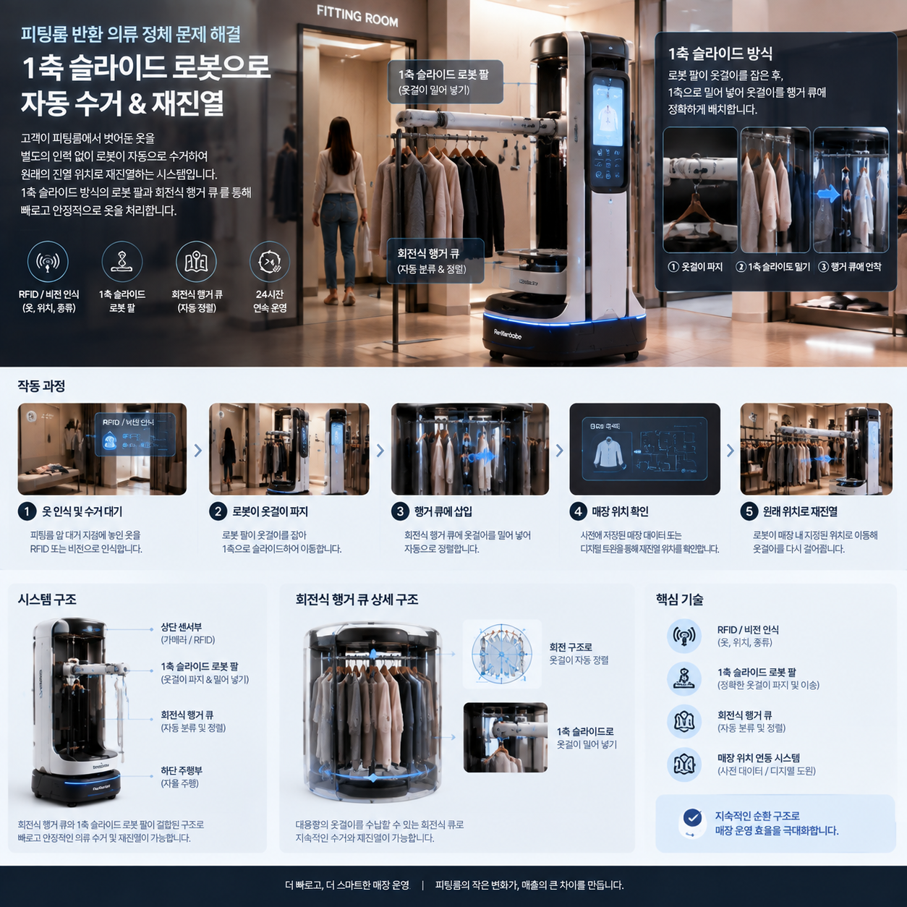
2. **외부 행거·로봇팔 방식**: 로봇 외부의 행거에 반환 의류를 적재하고, 다축 로봇팔로 옷걸이를 집어 매대에 재진열한다.

   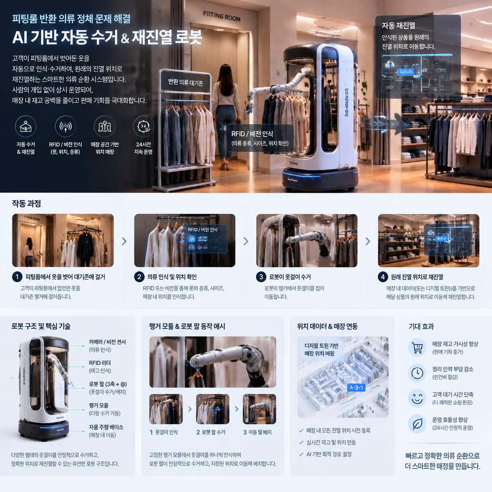

   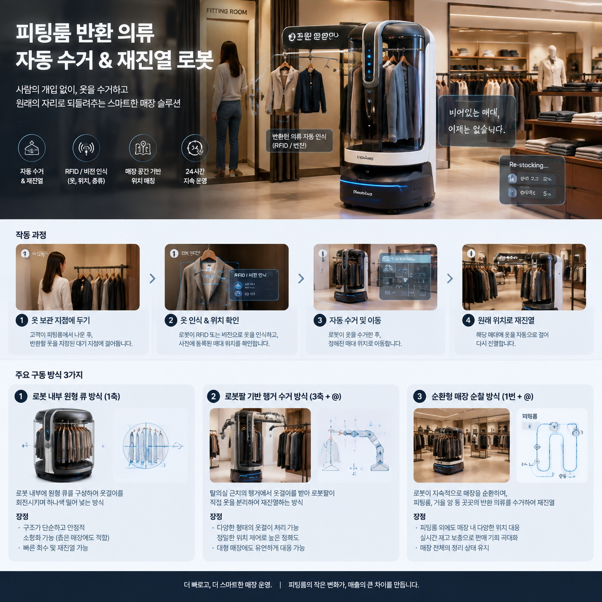
3. **순찰형 혼합 방식**: 로봇이 매장을 지속적으로 순찰하며 피팅룸 외부나 거울 주변에 놓인 의류까지 수거한다.

### 5. 기대효과 및 시연 방향

- 반환 의류의 재진열 시간을 줄여 매대의 재고 공백을 최소화한다.
- 혼잡 시간대의 반복적인 의류 운반 업무를 줄여 직원의 부담을 완화한다.
- 소규모 대기 행거와 목적 행거를 이용해 인식, 수거, 분류, 재진열의 전체 흐름을 시연할 수 있다.

---

## 2. 제출용 신규 아이디어 10개

### 1. 벽면 페인팅 및 유지보수 로봇

벽면 손상과 불법 그래피티를 사람이 직접 점검하고 재도색해야 하는 위험과 반복 작업을 줄이기 위한 로봇이다. 카메라로 벽면 결함과 원래 색상을 분석하고 필요한 영역만 정밀하게 도색하여 건물 유지보수 효율을 높인다.

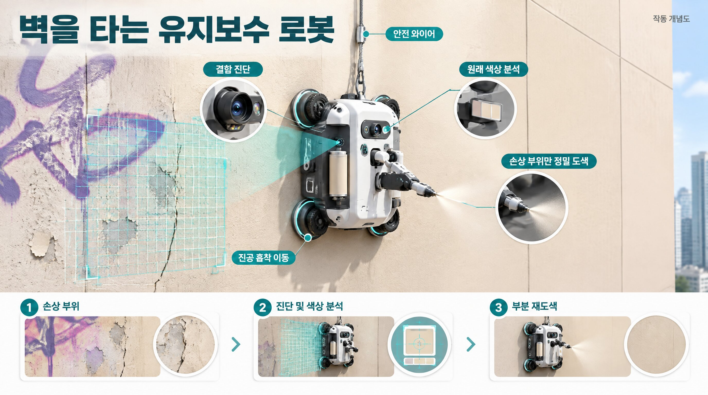

### 2. 완충재 가변 투입 및 상자 맞춤형 테이핑 시스템

중소 물류센터와 소상공인의 수작업 포장 부담을 줄이기 위한 데스크형 시스템이다. 물품과 완충재 종류에 따라 적정량을 투입하고 상자 크기에 맞춰 테이핑하여 작업 피로도와 포장 시간을 줄인다.

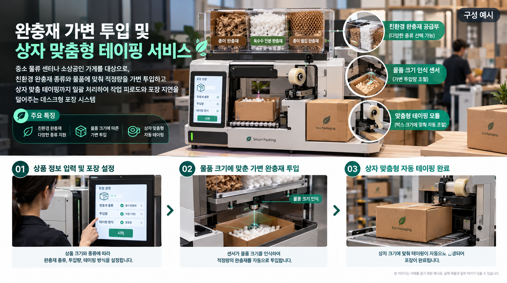

### 3. 오프라인 매장 내 자율 장보기 로봇

대형 오프라인 매장에서 사용자가 앱으로 선택한 상품을 로봇이 찾아 담아주는 쇼핑 보조 시스템이다. 사용자는 신선식품처럼 직접 확인이 필요한 상품에 집중하고, 나머지 상품 수집은 자동화할 수 있다.

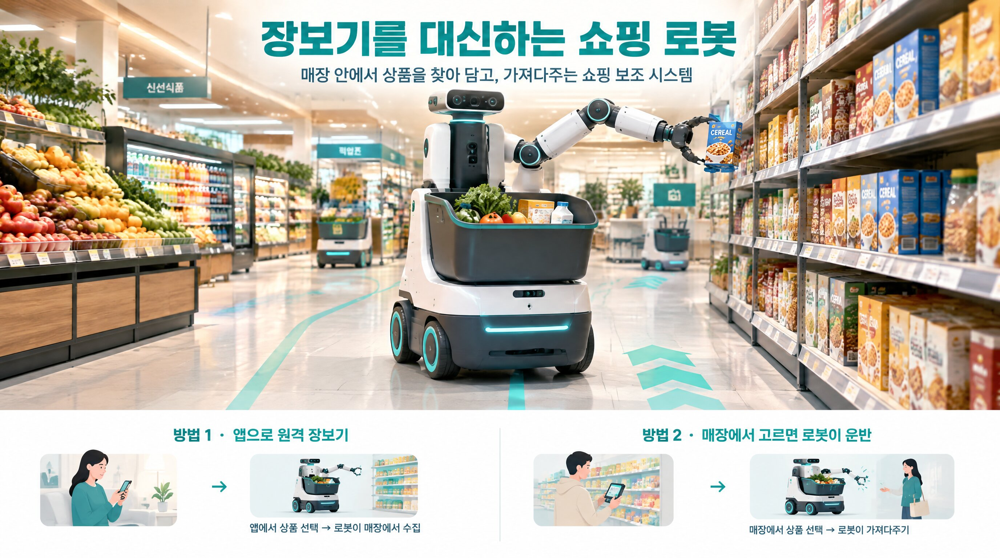

### 4. 다층 매장 카트 밸런스·자율 회수 시스템

매장 곳곳에 방치되거나 특정 층에 편중된 쇼핑 카트의 위치와 사용 상태를 파악한다. 사용이 끝난 카트를 가까운 보관소로 이동시키거나 여러 대를 군집 회수하여 매장 운영 효율을 높인다.

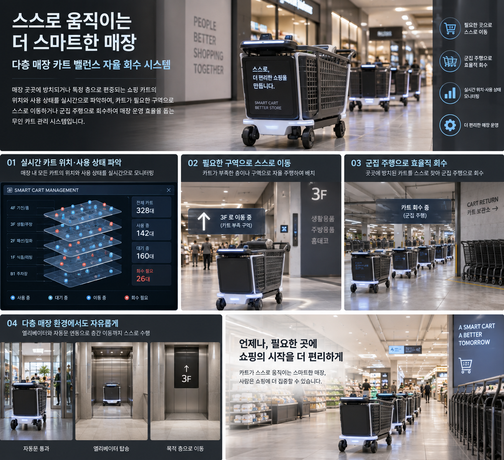

### 5. 마트 반납 물품 자동 재진열 시스템

계산대 반납대나 잘못된 위치에 놓인 상품을 수거해 원래 매대로 운반한다. 냉장·냉동식품은 우선순위 큐로 즉시 처리하고, 상온 상품은 일정 수량을 모은 뒤 이동하여 품질 저하와 반복 업무를 줄인다.

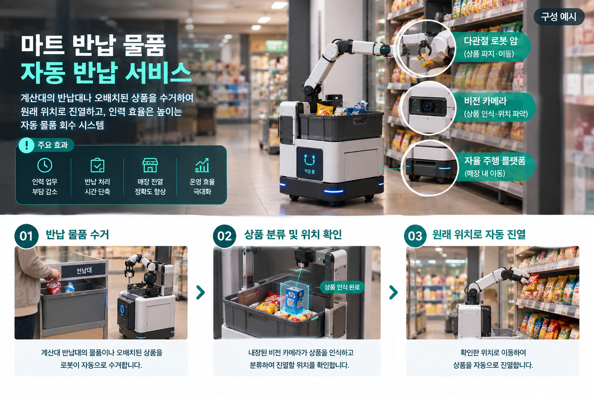

### 6. 전기차 번호판 미인식 해소 CCTV 시스템

야간이나 역광 환경에서 전기차 번호판의 재귀반사 소재로 발생하는 과노출을 줄이는 시스템이다. 전동 회전 편광 필터로 반사광을 1차 저감하고, AI OCR 보정으로 번호판을 복원하여 주차장과 도로 CCTV의 식별률을 높인다.

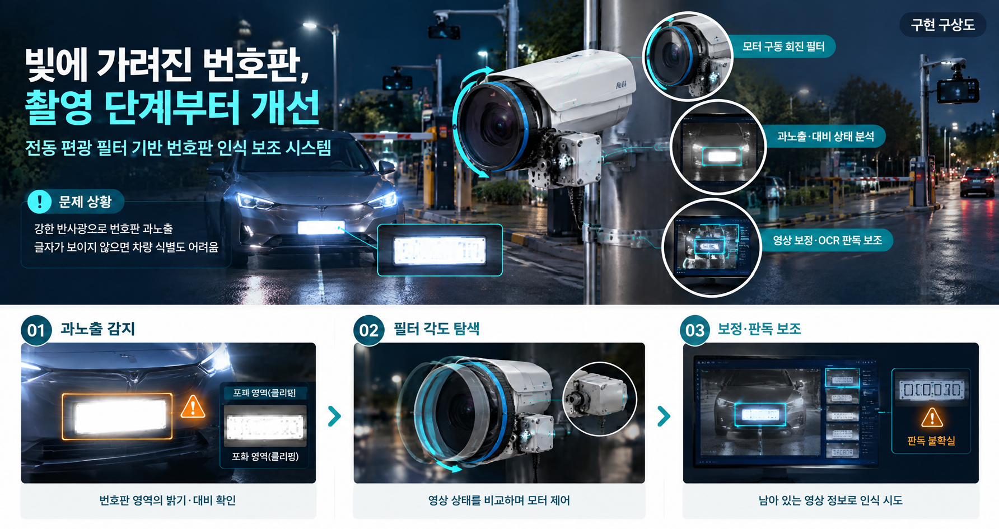

### 7. 수액 역류 방지 및 자동 긴급 클램프

수액 잔량과 튜브 내부 압력을 실시간으로 측정해 수액 소진이나 역류 위험을 감지한다. 이상 발생 시 튜브를 자동으로 차단하고 병상 번호·이상 유형·심각도를 의료진에게 전송하여 대응 시간을 단축한다.

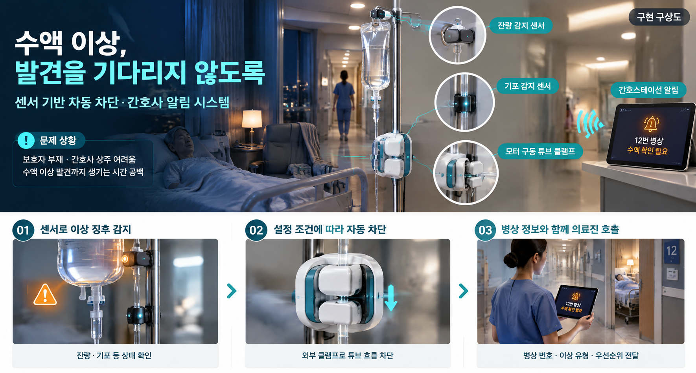

### 8. 안면 상태 기반 스마트 괄사 케어 시스템

얼굴의 좌우 비대칭과 부기 변화를 비교해 온열·쿨링 관리 방법을 제안한다. 괄사에 압력 센서와 햅틱 피드백을 적용하여 과도한 압력을 경고하고, 누적 데이터를 통해 개인별 관리 추이를 제공한다.

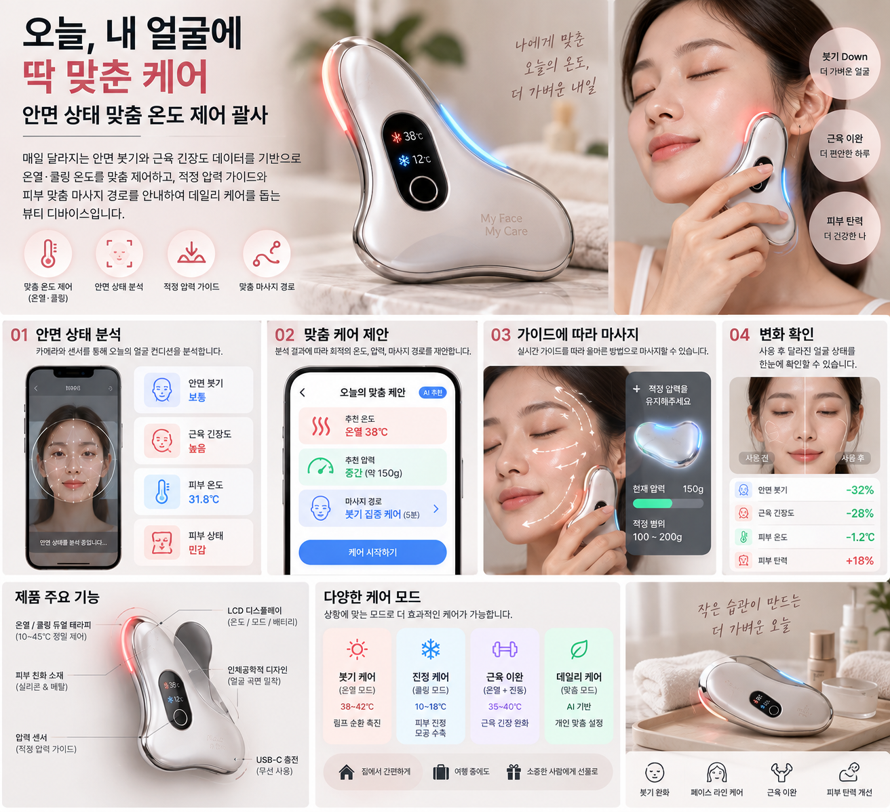

### 9. 소음 대응형 숙면 돔 시스템

주거 공간의 돌발 소음을 분석하고 소음 특성에 맞춰 역위상 음향이나 백색소음을 제공한다. 물리적 차음 구조와 사운드 마스킹을 결합하여 청각적 충격을 줄이고 수면 환경을 개선한다.

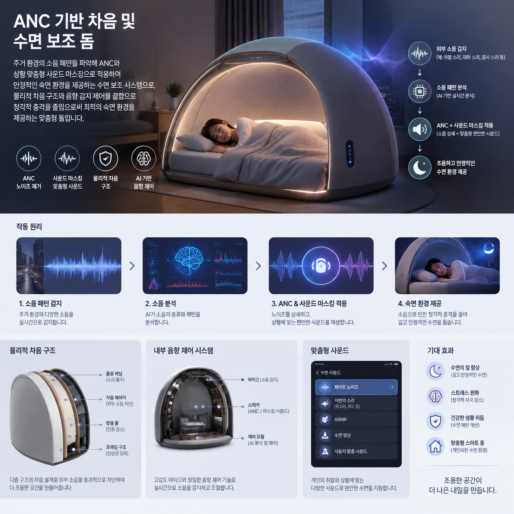

### 10. 온열질환 예방 스마트 마스크

폭염 환경에서 작업자나 야외 활동자의 이산화탄소 농도, 호흡수, 심박수, 피부 온도 등의 데이터를 측정한다. 위험 징후가 나타나면 사용자와 관리자에게 즉시 알림을 보내 온열질환과 과로 사고를 예방한다.

---

## 3. 추가 아이디어

1. **일조량 반응형 차량 차광 시스템**: 주차 후 일조량과 차량 내부 온도를 확인하여 앞유리 차광막을 자동으로 펼쳐 카시트와 핸들의 과열을 줄이는 시스템.
2. **자율주행 수상 수거 로봇**: 공원 호수처럼 잔잔한 수면에서 쓰레기와 이끼를 탐지하고 수거하는 수상 청소 로봇.
3. **랭킹 연동형 1인용 헬스 기구**: 운동 자세, 관절 각도, 압력 등을 측정해 수행 능력을 점수화하고 다른 사용자와 공유하여 운동 지속성을 높이는 시스템.

---

## 4. 결정 사항 및 다음 할 일

- 자동 의류 분류 및 재진열 시스템은 피팅룸 반환 의류 정체 문제를 핵심 사용 시나리오로 설정한다.
- 원형 큐 방식과 외부 행거·로봇팔 방식의 구조, 자유도, 적재량 및 재진열 성공률을 비교한다.
- 신규 아이디어 10개는 문제 상황, 사용자, 구현 방식, 기대효과와 시연 가능성을 같은 기준으로 보완한다.

---
