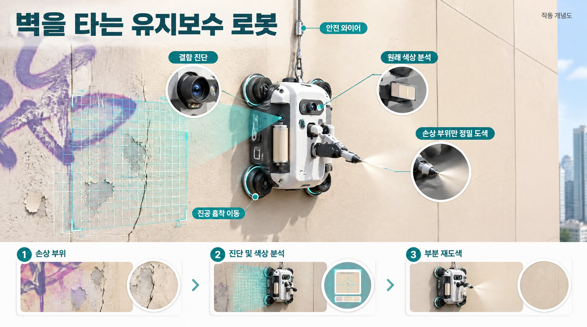
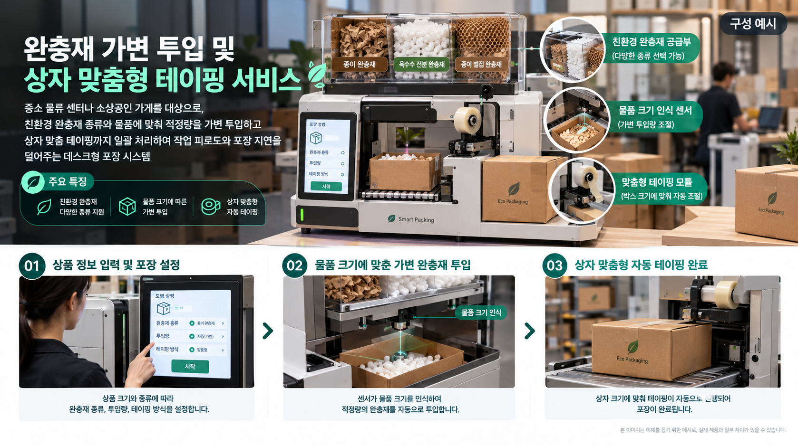
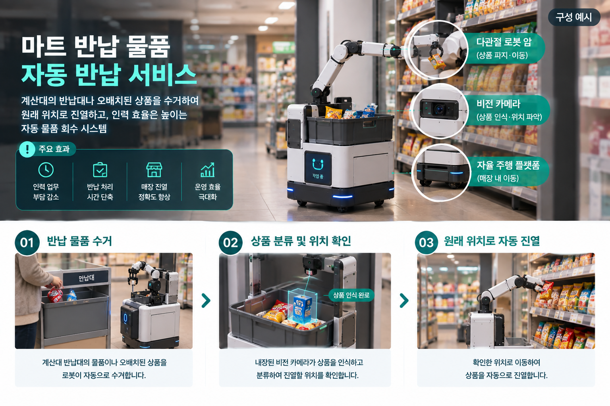
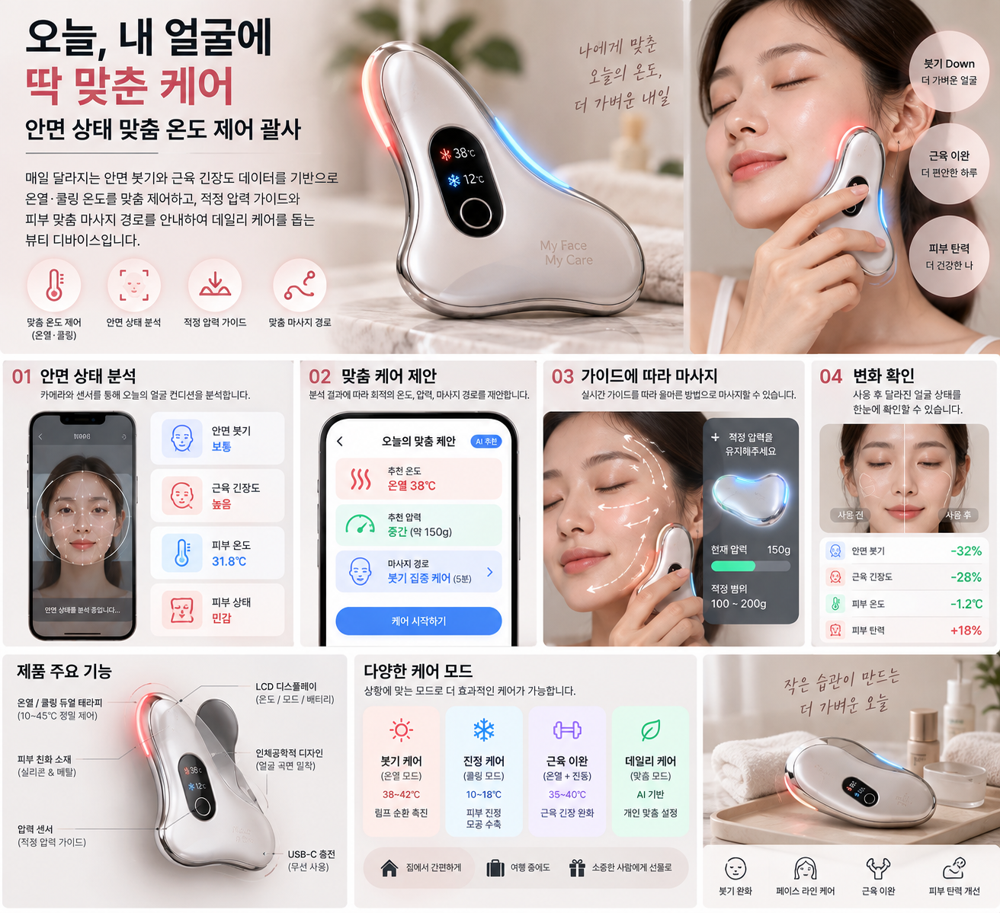
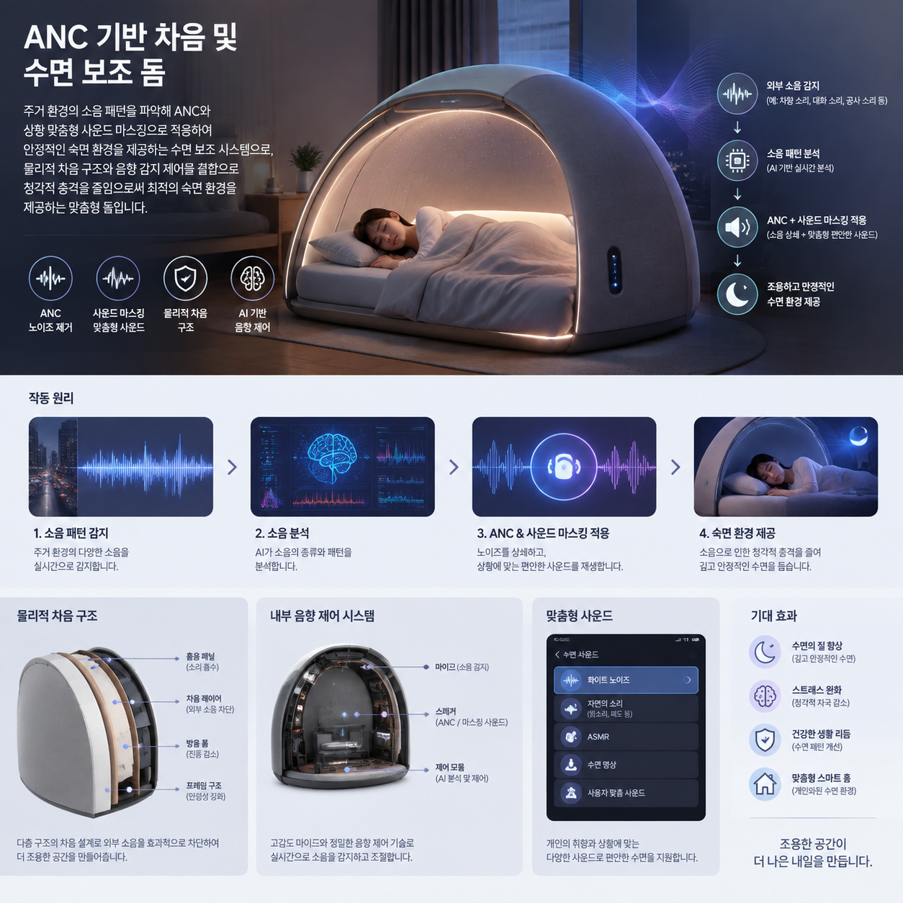
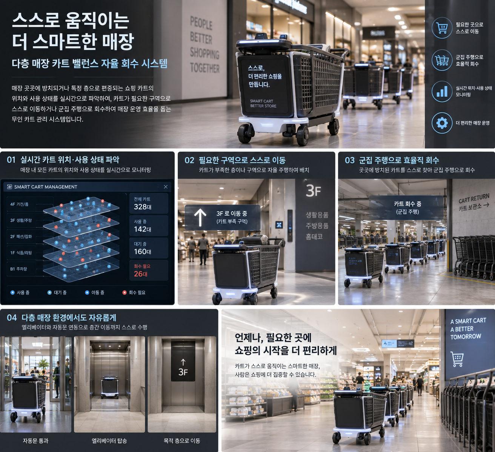
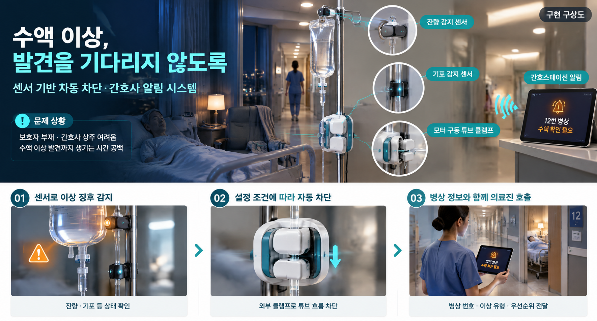
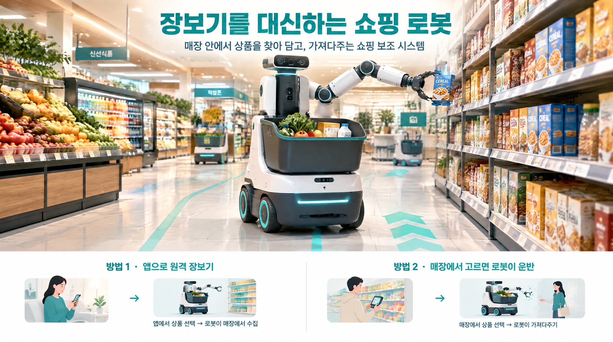
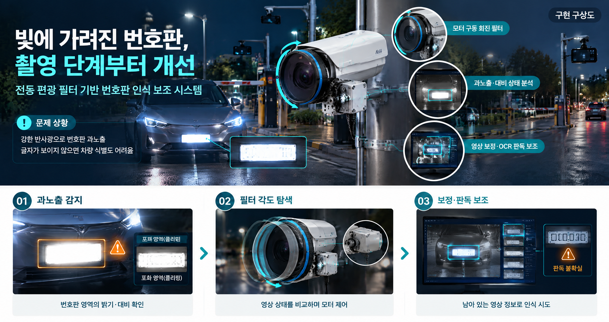

# 3주차 신규 아이디어 10개 디벨롭

| 항목 | 내용 |
| --- | --- |
| 회의 일시 | 2026.09.19 |
| 회의 시간 | 10:00 ~ 12:00 |
| 팀원 | 박상원, 유지원, 윤대준, 곽민지, 김민서 |

## 회의 목표

- 기존에 제안된 신규 아이디어의 문제 상황과 해결 방안을 구체화 하기
- 아이디어별 핵심 기능과 적용 시나리오를 정리하여 구현 방향을 명확히 하기

---

## 1. 추가 아이디어

### 1. 벽면 페인팅 로봇(불법 그래피티/벽면 결함/도색)

벽면의 손상이나 불법 그래피티를 일일이 수작업으로 덧칠해야 하는 위험과 번거로움을 해결하기 위해, 벽면 결함을 진단하고 원래 색상을 분석해 손상 부위만 정밀 재도색하는 건물 유지보수 로봇이다.

### 2. 완충재 가변 투입 및 상자 맞춤형 테이핑 서비스

중소 물류센터나 소상공인 가게를 대상으로, 친환경 완충재 종류와 물품에 맞춰 적정량을 가변 투입하고 상자 맞춤 테이핑까지 일괄 처리하여 작업 피로도와 포장 지연을 덜어주는 데스크형 포장 시스템이다.

### 3. 마트 반납 물품 자동 반납 서비스

계산대의 반납대나 오배치된 상품을 수거하여 원래 위치로 진열하고, 인력 효율을 높이는 자동 물품 회수 시스템이다.

### 4. 안면 상태 맞춤 온도 제어 괄사

매일 달라지는 안면 붓기와 근육 긴장도 데이터를 기반으로 온열·쿨링 온도를 맞춤 제어하고, 적정 압력 가이드와 피부 맞춤 마사지 경로를 안내하여 데일리 케어를 돕는 뷰티 디바이스이다.

### 5. ANC 기반 차음 및 수면 보조 돔

주거 환경의 소음 패턴을 파악해 ANC나 상황 맞춤형 사운드 마스킹을 적용하여 안정적인 숙면 환경을 제공하는 수면 보조 시스템이다. 물리적 차음 구조와 음향 감지·제어를 결합하여 청각적 충격을 줄이고 최적의 숙면 환경을 제공하는 맞춤형 돔이다.

### 6. 다층 매장 카트 밸런스 자율 회수 시스템

매장 곳곳에 방치되거나 특정 층으로 편중되는 쇼핑 카트의 위치와 사용 상태를 실시간으로 파악하여, 카트가 필요한 구역으로 스스로 이동하거나 군집 주행으로 회수하여 매장 운영 효율을 돕는 무인 카트 관리 시스템이다.

### 7. 수액 역류 방지·차단 및 알림 시스템

간호사나 보호자가 상시 관찰하기 어려운 환경에서 수액 고갈이나 역류 징후를 감지하여 튜브를 물리적으로 자동 차단하고, 우선순위 알림을 관리자에게 즉각 전달하여 발견 지연 시간을 줄이고 병원 인력 운용의 효율을 높이는 안전 관리 시스템이다.

### 8. 오프라인 매장 내 자율 장보기 로봇

앱을 통해 원격으로 대형 오프라인 매장에서의 장보기를 대신해 주는 쇼핑 시스템이다.

### 9. 전기차 번호판 미인식 해소 CCTV 시스템

야간 저조도나 역광 환경에서 전기차 번호판의 특수 재질로 인해 식별 실패율이 높은 문제를 해결하기 위해, 다양한 CCTV 환경에서 번호판 인식률을 높이는 영상 처리 시스템이다.

---

## 2. 결정 사항 및 다음 할 일

- 다음 회의에서 최종 아이디어를 확정한 후 세부 구현 방법과 역할을 논의한다.
- 아이디어의 구현 가능성, 시연 적합성, 필요 부품 및 예상 비용을 검토한다.
- 선정된 아이디어를 바탕으로 프로젝트의 핵심 동작과 전체 시스템 구조를 구체화한다.
- 총 예산 50만 원 이내에서 구현하기 위해 필요한 필수 부품을 조사하고 예상 비용을 산정한다.
