# 의류 순환을 위한 자율 재진열 로봇

| 항목 | 내용 |
| --- | --- |
| 회의 일시 | 2026.09.19 |
| 회의 시간 | 10:00 ~ 12:00 |
| 팀원 | 박상원, 유지원, 윤대준, 곽민지, 김민서 |

---

## 1. 문제 상황 1 및 해결 방안

### 1. 문제 상황

**피팅룸 반환 의류 적체 → 판매 가능 재고 공백 → 직원 재진열 업무 증가**

- 고객 집중 시간대(주말/세일 기간), 피팅룸 반환 의류가 대량으로 적체된다.
- 매장에 있어야 할 의류가 피팅룸에 머물며 판매 가능 재고의 공백이 발생한다.
- 직원은 반복적인 수거·재진열 업무에 지속 투입된다.
- 결제·고객 응대 등 주요 업무의 효율이 저하된다.

### 2. 해결 방안

- 로봇이 피팅룸 앞 반환 의류를 옷걸이째 자동 수거한다.
- 의류 정보를 인식하여 원래 진열 위치로 자동 운반·재진열한다.
- 피팅룸에 머물던 의류를 빠르게 복귀시켜 매대 재고 공백을 최소화한다.
- 반복적인 수거·재진열 업무를 줄여 직원이 고객 응대 등 핵심 업무에 집중하도록 한다.

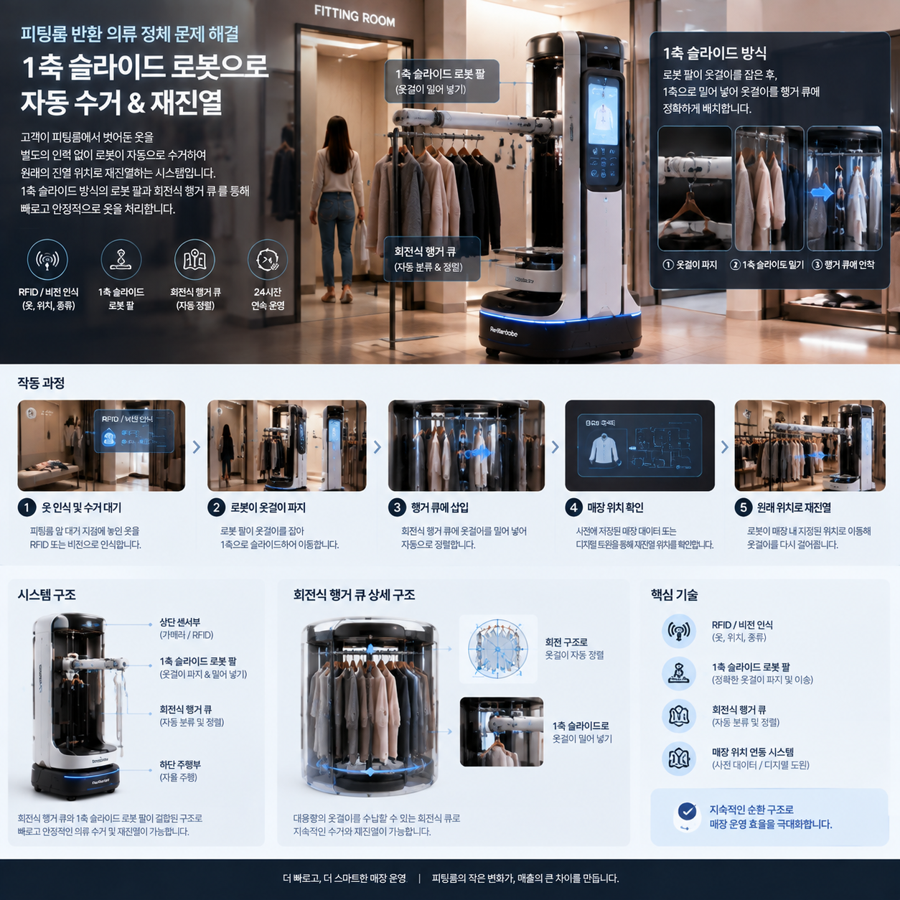

---

## 2. 문제 상황 2 및 해결 방안

### 1. 문제 상황

**반품·오진열 의류 발생 → 상품 위치 불일치 → 직원 정리·재진열 업무 증가**

- 손님이 구매하지 않은 의류를 정해진 반납처가 아닌 다른 매대에 오진열한다.
- 의류가 제자리에 있지 않아 상품 위치 및 실시간 재고 관리에 어려움이 발생한다.
- 방치 위치를 예측할 수 없어 직원의 발견과 회수가 늦어진다. 직원의 추가적인 정리·재진열 업무로 이어져 매장 관리 효율이 저하된다.

### 2. 해결 방안

평소에는 로봇이 매장을 돌며 오진열된 의류를 수거하고, 직원이 필요할 때는 로봇을 호출하여 바로 옷걸이에 걸어둘 수 있도록 지원한다.

- 직원이 캐셔 자리를 비우지 않고도 반품 의류를 쉽고 빠르게 처리한다.
- 오진열된 의류와 반품 의류를 신속하게 제자리로 복귀시켜 재고 유실과 매장 미관 저하를 방지한다.
- 반복적인 수거 업무를 줄여 직원이 결제 및 고객 응대 등 핵심 업무에 집중하도록 한다.

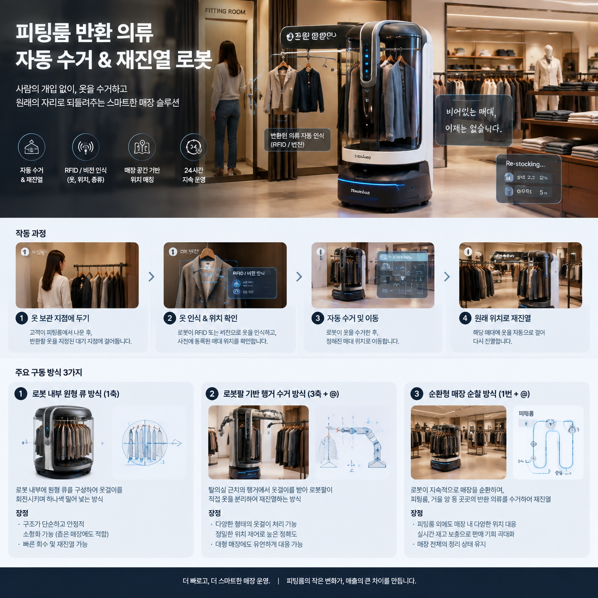

---

## 3. 구동 순서

1. **반납 감지**: 대기 지점의 센서/카메라가 옷 반납을 감지한다. 또는 순찰형이 주기적으로 확인한다.
2. **접근 및 정렬**: 로봇이 대기 지점으로 이동하여 정렬한다.
3. **회수(적재)**: 반환 지점에서 원형 큐(안 1) 또는 로봇팔(안 2)로 옷걸이를 적재한다.
4. **의류 인식**: RFID로 옷의 태그를 인식한다.
5. **위치 조회**: 매대별 정보를 수기 입력하거나 행거의 RFID를 자체 인식한다.
6. **이동**: 자율주행으로 장애물과 사람을 회피하며 매대까지 이동한다.
7. **재진열**: 지정 위치·순서에 맞춰 옷걸이를 건다.

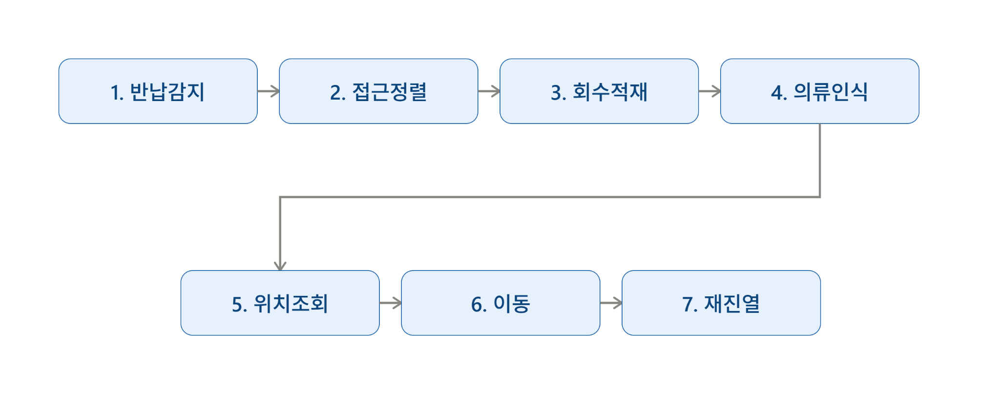

---

## 4. 구현 후보

### 1. 행거 형태

| 원형 | 일자형 |
| --- | --- |
| 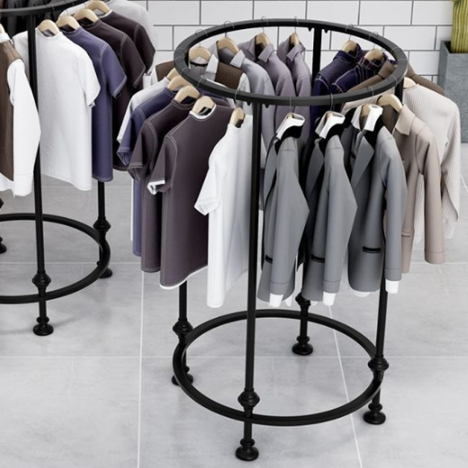 | 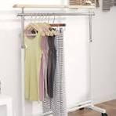 |

### 2. 형태

| 모듈형 | 내장형 |
| --- | --- |
| 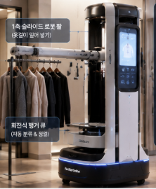 | 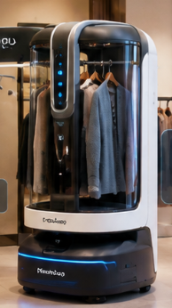 |

### 3. 재진열 방식

#### 3-1. 옷을 좌우로 펼쳐 공간 확보

로봇의 보조팔이 행거에 걸린 기존 의류를 좌우로 밀어 새로운 옷을 걸 수 있는 충분한 공간을 확보한다.

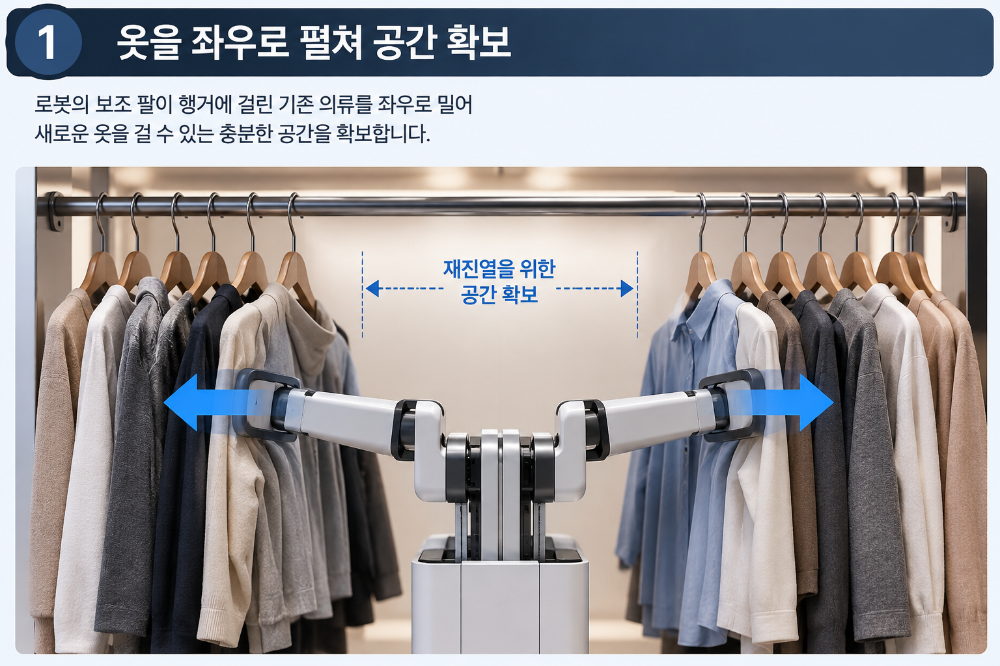

#### 3-2. 진열 방식 (슬라이드 방식 / 후크 방식)

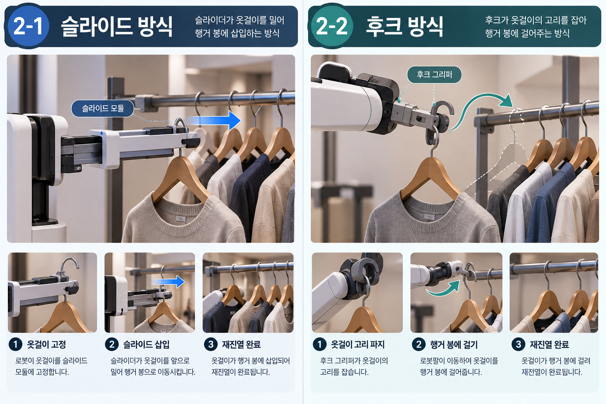

##### 1. 슬라이드 방식

슬라이더가 옷걸이를 밀어 행거 봉에 직접 삽입하는 방식이다.

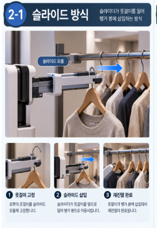

**작동 순서**

1. **옷걸이 고정**: 로봇이 옷걸이를 슬라이드 모듈에 단단히 고정한다.
2. **슬라이드 삽입**: 슬라이더가 작동하여 옷걸이를 앞으로 밀어 행거 봉으로 이동시킨다.
3. **재진열 완료**: 옷걸이가 행거 봉에 깔끔하게 삽입되며 재진열이 마무리된다.

##### 2. 후크 방식

후크 그리퍼가 옷걸이의 고리를 직접 잡아 행거 봉에 걸어주는 방식이다.

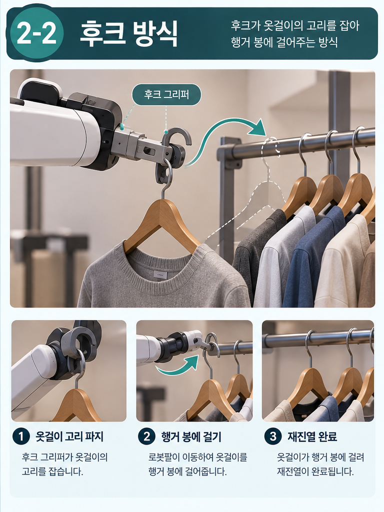

**작동 순서**

1. **옷걸이 고리 파지**: 후크 그리퍼가 옷걸이 상단의 고리 부분을 안전하게 잡는다.
2. **행거 봉에 걸기**: 로봇팔이 이동하여 옷걸이를 행거 봉에 자연스럽게 걸어준다.
3. **재진열 완료**: 옷걸이가 행거에 완전히 걸리면서 재진열 작업이 완료된다.

---