# 의류 순환을 위한 자율 재진열 로봇

| 항목 | 내용 |
| --- | --- |
| 회의 일시 | 2026.09.25 ~ 2026.09.26 |
| 회의 장소 | 온라인 |
| 회의 시간 | 22:00 ~ 익일 02:10 |
| 참석자 | 박상원, 곽민지, 김민서, 유지원, 윤대준 |

---

## 1. 문제 상황 1 및 해결 방안

### 1. 문제 상황

**피팅룸 반환 의류 적체 → 판매 가능 재고 공백 → 직원 재진열 업무 증가**

- 고객 집중 시간대(주말/세일 기간)에 피팅룸 반환 의류가 대량으로 적체된다.
- 매장에 있어야 할 의류가 피팅룸에 머물며 판매 가능 재고의 공백이 발생한다.
- 직원은 반복적인 수거·재진열 업무에 지속 투입된다.
- 결제·고객 응대 등 주요 업무의 효율이 저하된다.

### 2. 해결 방안

- 로봇이 피팅룸 앞 반환 의류를 옷걸이째 자동 수거한다.
- 의류 정보를 인식하여 원래 진열 위치로 자동 운반·재진열한다.
- 피팅룸에 머물던 의류를 빠르게 복귀시켜 매대 재고 공백을 최소화한다.
- 반복적인 수거·재진열 업무를 줄여 직원이 고객 응대 등 핵심 업무에 집중하도록 한다.

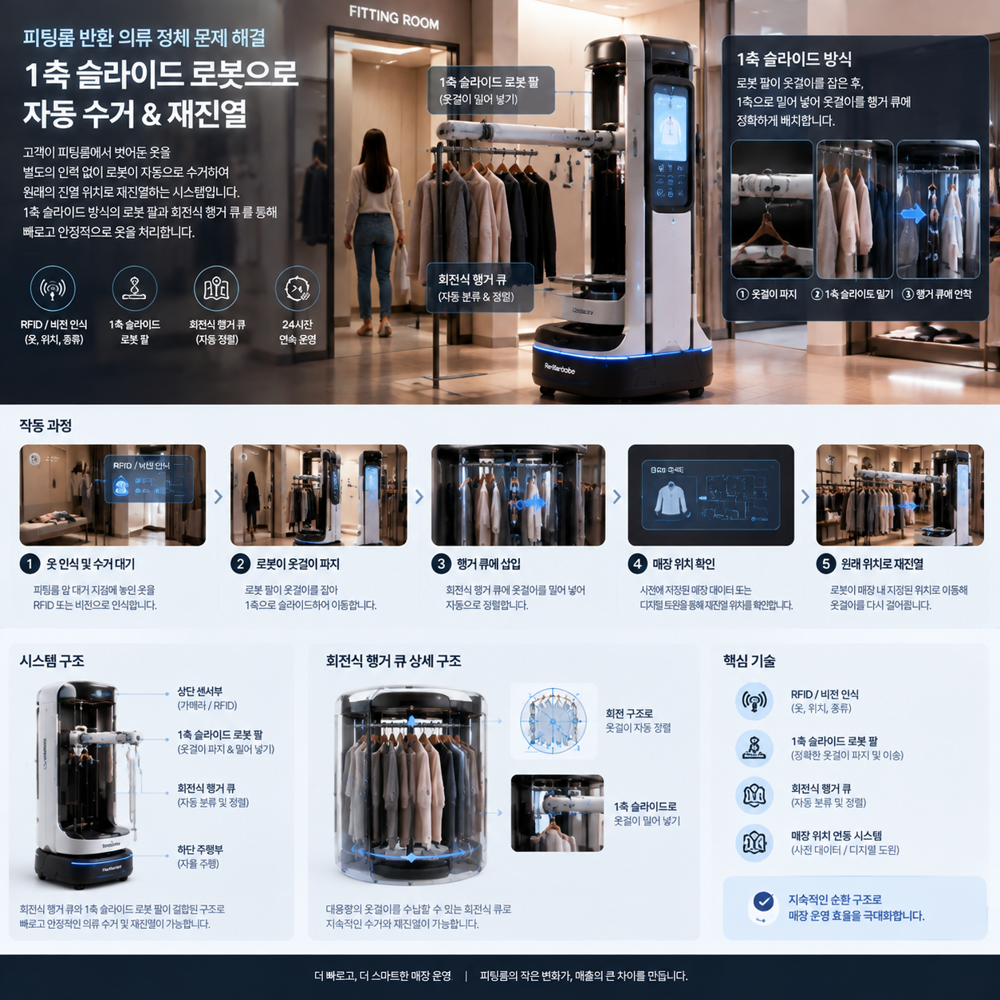

---

## 2. 구동 순서

1. **반납 감지**: 대기 지점의 센서/카메라가 옷 반납을 감지한다. 또는 순찰형이 주기적으로 확인한다.
2. **접근 및 정렬**: 로봇이 대기 지점으로 이동하여 정렬한다.
3. **회수(적재)**: 반환 지점에서 원형 큐(안 1) 또는 로봇팔(안 2)로 옷걸이를 적재한다.
4. **의류 인식**: RFID로 옷의 태그를 인식한다.
5. **위치 조회**: 매대별 정보를 수기 입력하거나 행거의 RFID를 자체 인식한다.
6. **이동**: 자율주행으로 장애물과 사람을 회피하며 매대까지 이동한다.
7. **재진열**: 지정 위치·순서에 맞춰 옷걸이를 건다.

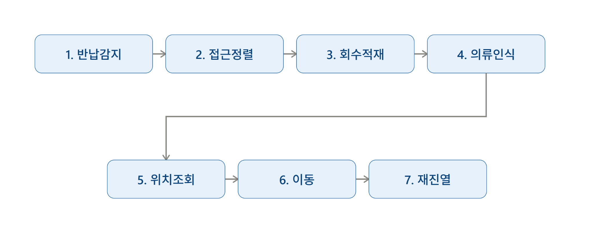

---

## 3. 구현 후보

### 1. 행거 형태

| 원형 | 일자형 |
| --- | --- |
| 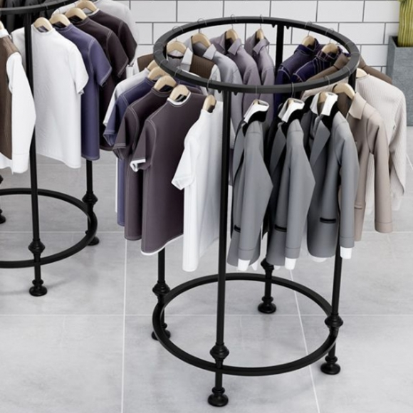 | 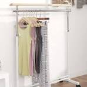 |

### 2. 형태

| 모듈형 | 내장형 |
| --- | --- |
| 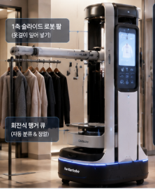 | 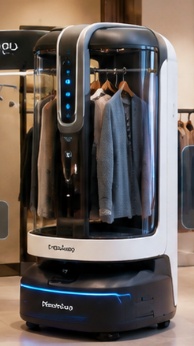 |

### 3. 재진열 방식

#### 3-1. 옷을 좌우로 펼쳐 공간 확보

로봇의 보조팔이 행거에 걸린 기존 의류를 좌우로 밀어 새로운 옷을 걸 수 있는 충분한 공간을 확보한다.

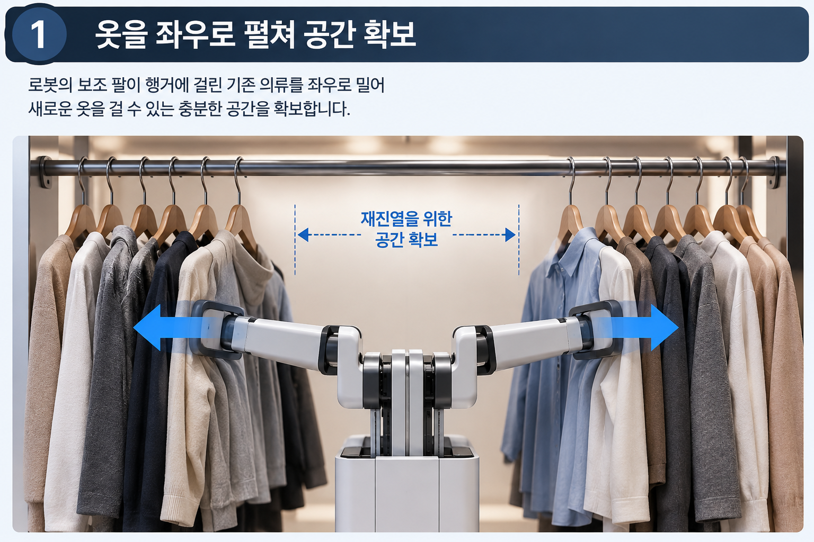

#### 3-2. 진열 방식 (슬라이드 방식 / 후크 방식)

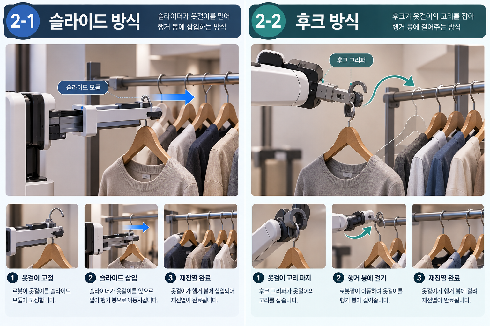

##### 1. 슬라이드 방식

슬라이더가 옷걸이를 밀어 행거 봉에 직접 삽입하는 방식이다.

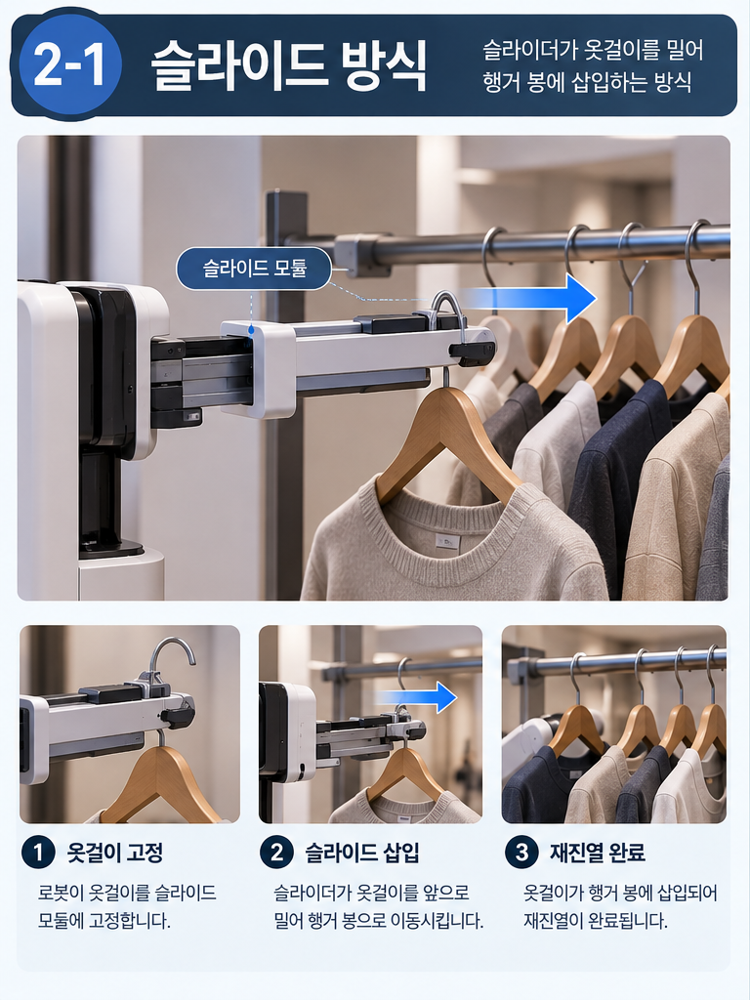

**작동 순서**

1. **옷걸이 고정**: 로봇이 옷걸이를 슬라이드 모듈에 단단히 고정한다.
2. **슬라이드 삽입**: 슬라이더가 작동하여 옷걸이를 앞으로 밀어 행거 봉으로 이동시킨다.
3. **재진열 완료**: 옷걸이가 행거 봉에 깔끔하게 삽입되며 재진열이 마무리된다.

##### 2. 후크 방식

후크 그리퍼가 옷걸이의 고리를 직접 잡아 행거 봉에 걸어주는 방식이다.

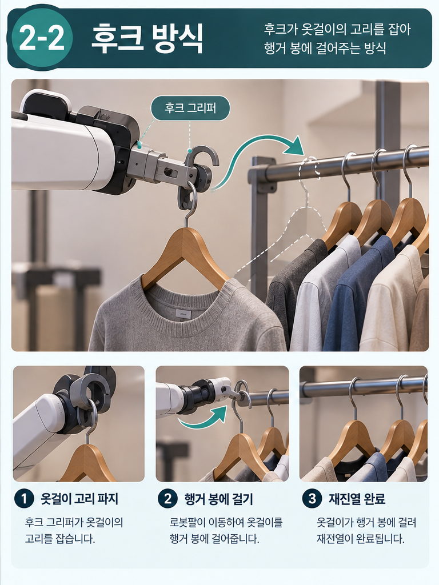

**작동 순서**

1. **옷걸이 고리 파지**: 후크 그리퍼가 옷걸이 상단의 고리 부분을 안전하게 잡는다.
2. **행거 봉에 걸기**: 로봇팔이 이동하여 옷걸이를 행거 봉에 자연스럽게 걸어준다.
3. **재진열 완료**: 옷걸이가 행거에 완전히 걸리면서 재진열 작업이 완료된다.

---

## 4. 선행기술 조사

### 1. 물류창고 형태

#### 1-1. Hanging clothes sorting robot, sorting system and sorting method

| 항목 | 내용 |
| --- | --- |
| 출처 | [Google Patents CN113023205A](https://patents.google.com/patent/CN113023205A/en) |
| 특허번호 | CN113023205A / CN113023205B |
| 출원인 | Suzhou Mushiny Intelligence Technology Co., Ltd. |
| 우선일 | 2021.03.16 |
| 공개 | 2021.06.25 |
| 등록 | CN113023205B, 2023.03.24 |
| 현재 표시 상태 | Active |

**1. 기술 개요**

의류 물류·창고에서 옷걸이에 걸린 의류를 자동으로 운반·분류하기 위한 이동형 로봇이다.

- 외부 의류 보관 랙(Rack; 옷을 걸어두는 전체 보관 구조물, 옷걸이 봉이 달린 진열대)의 옷을 로봇으로 가져오거나, 로봇이 운반한 옷을 다시 외부 랙으로 옮길 수 있다.
- 봉끼리 docking이라고 이해하면 쉽다. '같은 종류/주문 단위로 정리된 옷걸이 묶음'을 필요한 수량만큼 봉 사이에서 이동시키는 물류 시스템이다.
- DB에 저장된 clothing storage position으로 이동한다.

**2. 기술**

① 행거봉 간 Docking 기반 의류 이송

- 이동 베이스 + 임시 행거봉 + 의류 이송 메커니즘으로 구성된다.
- 로봇의 임시 행거봉과 외부 Storage 행거봉을 정렬한 뒤 서로 Docking한다.
- 옷걸이를 하나씩 grasping하는 방식이 아니라, 신축식 이송 구조와 선형 액추에이터를 이용해 옷걸이를 봉을 따라 슬라이딩하여 이동한다.
- 필요한 수량에 맞춰 이송량을 조절하므로 한 벌뿐 아니라 여러 벌을 한 번에 이송할 수 있다.
- 외부 행거봉 → 로봇뿐 아니라 로봇 → 외부 행거봉 방향의 입·출고가 모두 가능하다.

② 의류 종류별 Storage Position 기반 자동 분류

- 상위 시스템의 작업정보에 의류 종류(type)와 필요한 수량(quantity)이 정의되어 있다.
- 의류 종류/주문 단위에 대응하는 clothing storage position을 시스템이 관리한다.
- 로봇이 의류를 직접 보고 종류를 판별해 위치를 찾는 방식이 아니라, 작업정보와 저장된 Storage Position을 기반으로 목표 위치를 결정한다.
- 목표 Storage Position까지 경로를 계획하고 이동한 뒤 행거봉을 Docking하여 필요한 수량을 입·출고한다.

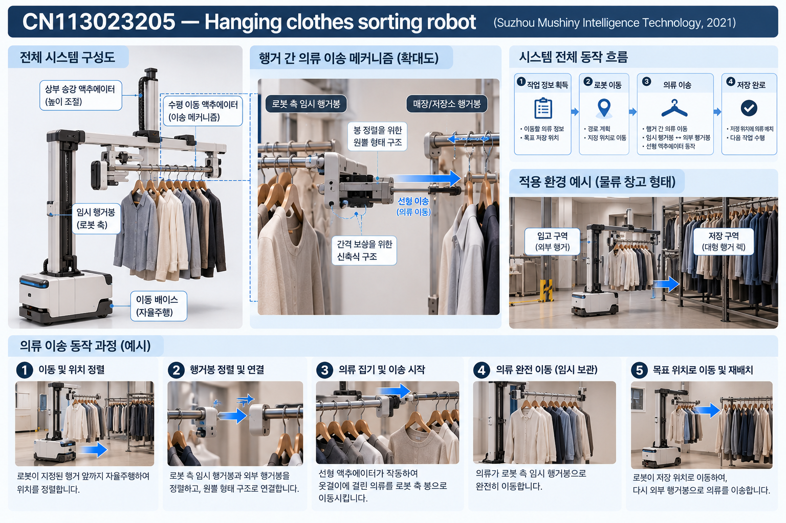

**3. 본 프로젝트 아이디어와의 비교 분석**

① 공통점

- 이동 로봇이 옷걸이째 의류를 운반한다.
- 여러 벌의 의류를 로봇에 임시 보관할 수 있다.
- 목표 위치까지 이동하여 의류를 외부 행거에 다시 배치한다.
- 선형 이송 기구를 이용한 행거봉 간 의류 이동이라는 점에서 현재 검토 중인 슬라이드 방식과 유사하다.

② 차이점

해당 특허는 **의류 물류창고의 입·출고 및 분류 자동화**가 목적이다.

- 핵심은 정해진 위치에 종류/주문 단위로 관리되는 의류를 필요한 수량만큼 봉 간 이송하는 것이다.
- 따라서 단순히 "기존 특허는 옷을 가져오고, 우리는 가져다 놓는다"는 차이는 정확하지 않다. 해당 특허도 로봇 → Storage Position 방향의 입고가 가능하다.
- 우리는 피팅룸 등에 서로 다른 상품이 랜덤하게 섞여 반환되는 상황을 대상으로 한다.
- RFID 등을 통해 반환된 개별 의류를 식별 → 상품별 원래 판매 행거 위치와 매칭 → 서로 다른 위치로 개별 재진열하는 과정이 핵심이다.
- 즉, 정해진 위치에서 필요한 수량을 가져오거나 넣는 물류 시스템과, 랜덤하게 반환된 개별 의류를 각각의 원래 판매 위치로 복귀시키는 재진열 시스템이라는 차이가 있다.
- 일반 매장 행거 및 기존 진열 의류 사이에 다시 삽입하는 환경을 대상으로 한다.

---

#### 1-2. 바바패션, 물류 센터 행거 자동화 및 AGV 시스템

| 항목 | 내용 |
| --- | --- |
| 관련 링크 | [https://buly.kr/FsLMd52](https://buly.kr/FsLMd52) |

**1. 요약**

대형 의류 물류센터에서 AGV/AMR과 행거 자동화 설비를 연동하여, 옷걸이에 걸린 상태의 의류를 자동으로 이송·분류·출고하는 물류 자동화 시스템이다.

- 작업자가 상품 바코드를 스캔하면 시스템이 주문 정보와 상품의 일치 여부를 확인하고, 해당 상품을 지정된 목적지까지 이송한다.
- 의류를 접어서 박스 단위로 운반하는 방식과 달리 의류가 행거에 걸린 상태를 유지하면서 물류 프로세스를 자동화하는 것이 특징이다.
- 대규모 물류센터에서 반복적으로 발생하는 의류 운반 및 분류 작업의 자동화를 목적으로 한다.

**2. 기술**

① AGV/AMR 기반 의류 이송

- 물류센터 내부에서 로봇이 지정된 목적지까지 이동한다.
- 행거에 걸린 의류를 자동화 설비와 연계하여 필요한 장소까지 운반한다.
- 작업자의 직접 운반 업무를 줄이고 대량의 의류를 효율적으로 처리한다.

② 바코드 및 주문정보 기반 상품 관리

- 작업자가 상품 바코드를 스캔하여 상품 정보를 시스템에 입력한다.
- 주문 정보와 실제 상품의 일치 여부를 자동으로 확인한다.
- 확인된 상품을 주문 및 출고 목적지에 따라 분류한다.

③ 행거 자동화 설비와 물류 로봇의 연계

- 행거 이송 시스템과 물류 로봇을 연결하여 의류의 이동·분류·출고 과정을 자동화한다.
- 대량의 의류를 처리하는 물류센터 환경에 최적화된 구조이다.

**3. 본 프로젝트 아이디어와의 비교 분석**

① 공통점

- 이동형 로봇을 이용하여 의류 운반 업무를 자동화한다.
- 의류를 옷걸이에 걸린 상태로 이동시킨다.
- 상품 정보를 기반으로 의류의 목적지를 결정하고 해당 위치까지 이동한다.
- 사람이 반복적으로 수행하던 의류 운반 업무를 로봇으로 보조 또는 자동화한다.

② 차이점

해당 특허는 **의류 물류창고의 입·출고 및 분류 자동화**가 목적이다.

- 해당 시스템은 대형 물류센터에서 대량의 의류를 분류·출고하는 물류 자동화가 목적이다.
- 대규모 자동화 설비와 충분한 공간 및 구축 비용을 전제로 하기 때문에 일반 의류 매장에 그대로 적용하기 어렵다.
- 우리는 물류센터가 아니라 고객이 직접 이용하는 오프라인 의류 매장과 피팅룸을 대상으로 한다.
- 피팅룸에서 서로 다른 상품이 무작위로 반환되는 상황에서 개별 의류 식별 → 원래 판매 위치 확인 → 매장 내 이동 → 기존 행거에 재진열하는 과정이 핵심이다.
- 기존 매장 인테리어와 행거 구조를 최대한 유지하면서 사용할 수 있는 소형·모듈형 이동 로봇을 목표로 한다.

---

#### 1-3. Automated garment storage and retrieval system

| 항목 | 내용 |
| --- | --- |
| 관련 링크 | [https://buly.kr/FsLMd52](https://buly.kr/FsLMd52) |

**1. 요약**

Garment-on-Hanger(GOH)를 자동으로 보관하고 꺼내기 위한 의류 자동창고 시스템이다.

- 의류를 운반하는 Transporter와 의류를 실제 보관 위치에 넣고 꺼내는 Forager를 조합한다.

**2. 기술**

① 시스템 구성 및 핵심 기구

- **Transporter / Forager**: 처리 구역 ↔ 저장 구역 간 GOH(행거 의류) 자동 운반 및 피킹 로봇
- **Mother hook**: 일반 옷걸이 상단에 결합하는 표준 인터페이스. 돌기(mounting stud)를 전용 slot에 체결·고정한다.
- **기구부**: Picker arm(승강·전후진 조작) + 좌·우 Blade(주변 의류를 밀어내 공간 확보)
- **인프라**: Rail, Elevator, 전용 Slot Rack 등 규격화된 자동창고 설비 기반

② 의류 추출·삽입 메커니즘

**추출 과정 (Pick)**

1. **공간 확보**: 좌·우 Blade가 인접 의류 사이로 진입 후 양옆으로 벌려 공간을 확보한다.
2. **체결 및 해제**: Picker arm이 전진해 Mother hook을 결합한 뒤, 살짝 들어 올려 Slot 잠금을 해제한다.
3. **인출 완료**: Arm을 후진(Retract)해 의류를 인출한 뒤 Blade가 복귀한다.

**삽입 과정 (Place)**

1. **공간 확보**: Blade를 목표 위치 양옆에 진입 후 벌려 삽입 공간을 확보한다.
2. **진입 및 체결**: Arm이 의류를 잡고 전진하여 Slot 넓은 부위로 Stud를 삽입한 뒤, 하강시켜 걸림 고정한다.
3. **삽입 완료**: Hook 결합을 해제한 뒤 Picker arm 및 Blade가 후퇴 복귀한다.

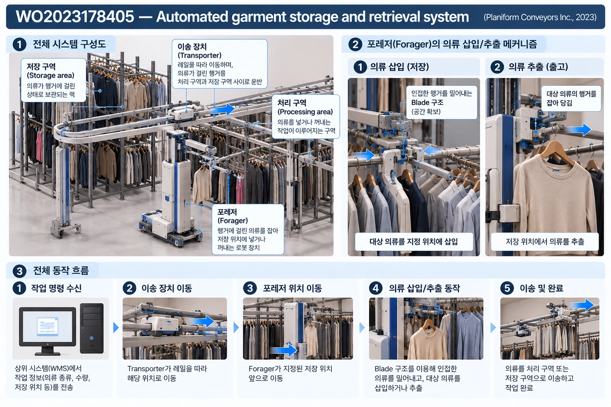

**3. 본 프로젝트 아이디어와의 비교 분석**

① 공통점

- 옷걸이에 걸린 상태의 의류를 자동 운반·재배치한다.
- 목표 위치에 옷걸이를 자동 삽입한다.
- 주변 의류를 좌우로 이동시켜 진열 공간을 확보한다는 점이 우리가 구상한 재진열 방식과 매우 유사하다.

② 차이점

해당 특허는 **의류 물류창고의 입·출고 및 분류 자동화**가 목적이다.

- 전용 레일, 엘리베이터, 슬롯 랙 등 사전 구축된 대형 자동창고 설비가 필수적인 환경에서만 동작한다.
- 일반 옷걸이를 직접 다루지 못하고, 옷걸이마다 'Mother hook'이라는 표준화된 전용 체결 부품을 별도로 장착해야만 조작할 수 있다.
- 개별 반환 의류의 매장 재진열이 아니라, 규격화된 보관 구역 간 대량 의류의 자동 입출고 및 보관에 초점이 맞춰져 있다.
- 전용 슬롯 체결 메커니즘을 일반 매장에 그대로 도입하기는 어려워, 밀집된 의류를 좌우로 벌려주는 블레이드 원리 정도만 선별 차용할 수 있다.

---

### 2. RFID 태그 인식 관련

#### 2-1. Stock visibility for retail using an RFID robot

| 항목 | 내용 |
| --- | --- |
| 출처 | [Stock visibility for retail using an RFID robot](https://www.sciencedirect.com/science/article/pii/S0960003519000217) |
| 자료 유형 | 논문 |
| 학술지 | International Journal of Physical Distribution & Logistics Management, Vol.49 No.10 |
| 연도 | 2019 |
| DOI | 10.1108/IJPDLM-03-2018-0151 |

**1. 요약**

사람이 RFID handheld reader를 들고 매장 재고를 조사하는 대신, 자율주행 로봇이 RFID를 이용하여 item-level 재고와 위치를 자동 파악하는 연구이다.

**2. 기술**

- 자율주행 로봇과 RFID reader를 결합한다.
- 매장 내 상품의 개수뿐 아니라 위치까지 파악하여 stock visibility를 향상시킨다.
- 수작업 RFID 재고조사를 자동화하는 것이 목적이다.

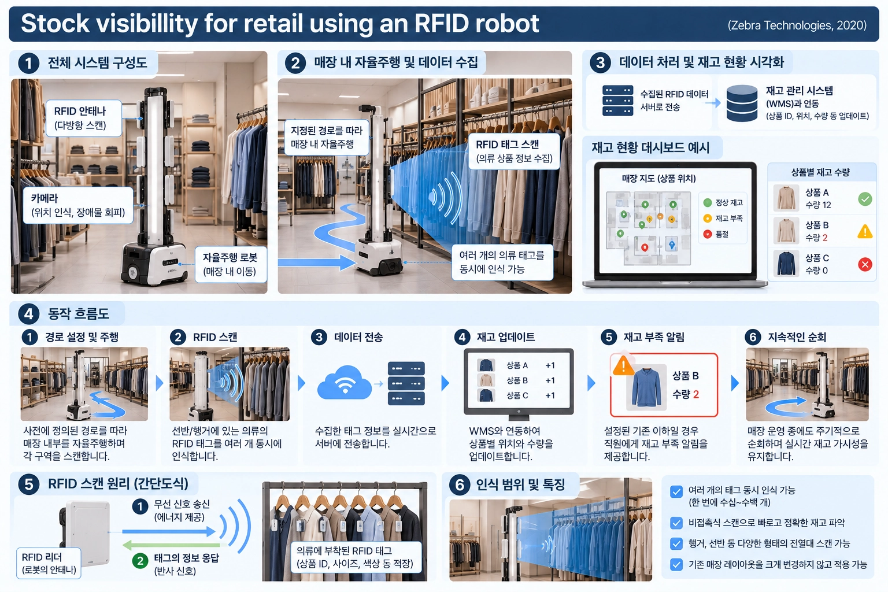

**3. 본 프로젝트 아이디어와의 비교 분석**

① 공통점

- 자율주행 로봇과 RFID를 결합해 매장 내 상품을 식별한다.
- 상품의 실제 위치 정보를 재고 관리에 활용한다.

② 차이점

해당 연구는 **재고를 읽고 위치를 파악하는 것**까지가 핵심이다.

- 상품을 직접 잡거나 이동·재진열하지 않는다.
- 우리는 식별 결과를 이용해 로봇이 실제 의류를 원래 위치까지 물리적으로 복귀시킨다.

---

#### 2-2. Adler Modemärkte - TORY RFID Inventory Robot

| 항목 | 내용 |
| --- | --- |
| 출처 | [German Clothing Retailer Adler Gives RFID Robots a Spin](https://www.rfidjournal.com/news/german-clothing-retailer-adler-gives-rfid-robots-a-spin/72056/) |
| 자료 유형 | 실제 의류매장 적용 사례 / 기사 |
| 기업 | Adler Modemärkte, MetraLabs |
| 로봇 | TORY |
| 기사 | RFID Journal, 2016.02.12 |

**1. 요약**

독일 의류 체인 Adler가 실제 매장에서 RFID 자율주행 재고조사 로봇 TORY를 시험 도입한 사례이다.

- 이후 다수 매장으로 확대 적용된 사례가 보고되었다.

**2. 기술**

- UHF RFID reader와 antenna array를 로봇에 탑재한다.
- laser·camera sensor를 이용해 매장 내부를 자율주행한다.
- 이동하면서 상품 RFID tag를 읽어 재고 수량 및 상품 위치를 기록한다.
- 상품명과 매장 지도상의 위치를 연계하여 특정 상품 위치 안내도 가능하다.
- ERP와 EPC·timestamp·공간 위치 데이터를 연동한다.

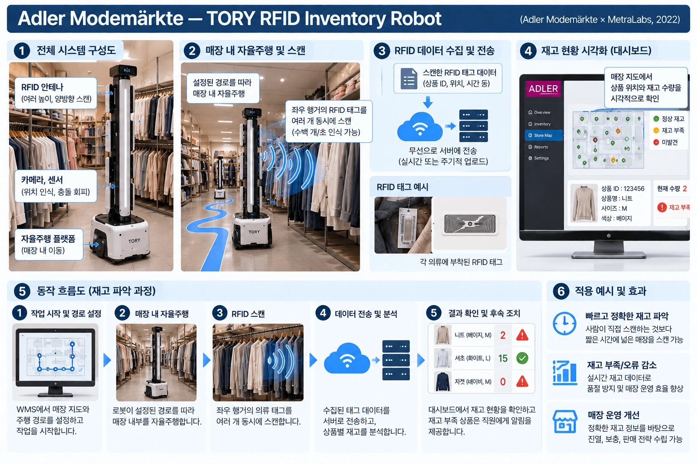

**3. 본 프로젝트 아이디어와의 비교 분석**

① 공통점

- 실제 의류 판매 매장에서 동작하는 자율주행 로봇이다.
- RFID를 이용한 의류 식별 및 위치 관리를 수행한다.
- 직원의 반복적인 재고관리 업무를 줄여 판매·고객응대에 집중시키려는 목적이 같다.

② 차이점

해당 연구는 **재고를 읽고 위치를 파악하는 것**까지가 핵심이다.

- TORY는 상품의 위치를 탐색·기록하지만 의류를 물리적으로 이동시키지 않는다.
- 우리는 반환·오진열된 의류를 실제로 수거하여 원래 행거에 재진열한다.

---

#### 2-3. Badger Technologies - RFID Inventory Robot

| 항목 | 내용 |
| --- | --- |
| 관련 링크 | [https://www.badger-technologies.com/](https://www.badger-technologies.com/) |
| 기업 | Badger Technologies |
| 분야 | Retail Automation / Autonomous Mobile Robot / Computer Vision / AI |
| 현재 상태 | 상용 리테일 자동화 솔루션 운영 중 |

**1. 요약**

대형 리테일 매장 내부를 자율주행하면서 진열대와 통로를 반복적으로 스캔하는 매장 관리 로봇이다.

- Computer Vision과 AI를 이용해 품절 상품, 가격 오류, 상품 위치 및 진열 상태 등을 확인한다.
- 확인한 정보를 매장 시스템과 연동하여 재입고, 가격 수정, 진열 정비 등 직원이 처리해야 할 작업으로 전달한다.
- 상품을 직접 옮기는 로봇이라기보다 매장을 순회하면서 현장 상태를 확인하고 작업을 알려주는 로봇에 가깝다.

**2. 기술**

① 자율주행 기반 매장 순회

- 매장 통로와 진열 구역을 반복적으로 주행하며 매장 상태를 확인한다.
- 사람이 직접 매장을 돌면서 수행하던 진열·재고 점검 업무를 자동화한다.
- 사람, 카트 등이 함께 움직이는 실제 영업 환경에서 매장을 순회하는 구조이다.

② Computer Vision·AI 기반 진열 상태 확인

- Camera와 AI를 이용하여 실제 진열대 상태를 확인한다.
- 품절 상품, 가격 불일치, 잘못된 상품 위치, 프로모션 상태 등을 탐지한다.
- 단순 재고 수량보다는 실제 판매대에 상품이 제대로 진열되어 있는지 확인하는 데 초점을 둔다.

③ 상품 위치·재고 정보 관리

- 반복적인 매장 Scan을 통해 상품 위치와 진열 상태를 데이터화한다.
- 예상 위치와 실제 진열 상태를 비교하여 오배치나 품절 등을 확인한다.
- 확인된 문제를 재입고·가격 수정 등 직원이 처리해야 할 작업으로 연결한다.

④ 작업 우선순위화

- 발견된 문제를 단순히 알려주는 데 그치지 않고 재입고 등 필요한 작업의 우선순위를 정한다.
- 매장 직원이 우선적으로 처리해야 할 작업을 확인할 수 있도록 지원한다.

**3. 본 프로젝트 아이디어와의 비교 분석**

① 공통점

- 매장 내부를 이동하면서 반복적인 확인 작업을 자동화한다.
- 상품 위치와 진열 상태를 확인하고 매장 운영 시스템에 반영한다.
- 수집한 정보를 바탕으로 잘못 진열된 상품이나 필요한 작업을 판단한다.

② 차이점

해당 연구는 **재고를 읽고 위치를 파악하는 것**까지가 핵심이다.

- Badger는 Computer Vision·AI를 이용한 매장 상태 확인과 직원 작업 지원이 중심이다.
- 상품을 직접 집거나 옷걸이를 이동시켜 재진열하는 구조는 아니다.
- 우리 시스템은 RFID로 반환 의류를 개별 식별한 뒤 원래 위치를 찾고, 실제로 의류를 해당 행거 위치까지 이동·재진열하는 것이 핵심이다.
- 따라서 Badger의 매장 상태 인식 → 문제 탐지 → 작업 지시에서 더 나아가 의류 식별 → 목적지 결정 → 이동 → 행거 삽입 → 재진열까지 수행하는 구조이다.

---

## 5. 예산

**캡스톤 디자인 예산안 (악마들은 프라다를 입는다)**

| 품목 | 이름 | 역할 | 가격 | 개수 | 총액 | 링크 |
| --- | --- | --- | ---: | ---: | ---: | --- |
| 원형 행거 | 써클무빙 이동식 스탠드 옷걸이 행거 | 옷걸이 | ₩59,900 | 1 | ₩59,900 | [링크](https://l1nq.com/4rqm2zw) |
| 모터 | NEMA17 스텝모터(한국이구스, 국내재고) | 원형 행거 회전 인덱싱 | ₩45,660 | 1 | ₩45,660 | [링크](https://l1nq.com/8oe4ijx) |
| 모터 | Dynamixel AX-12A(로보티즈, 국산) | 옷걸이 파지 | ₩52,800 | 1 | ₩52,800 | [링크](https://sl1nk.com/zeq8eas) |
| 모터 | 소형 리니어 액추에이터(모터뱅크 자체제작) | 슬라이드 삽입 | ₩49,000 | 1 | ₩49,000 | [링크](https://sl1nk.com/d1gvxyh) |
| 모터 | DC모터(보조팔용) | 좌우 공간확보 | ₩17,000 | 1 | ₩17,000 | [링크](https://buly.kr/6XpCRSA) |
| RFID | UHF RFID 리더(가치창조기술, 국내) | RFID 리더 | ₩169,500 | 1 | ₩169,500 | [vctec.co.kr](https://vctec.co.kr/product/uhf-rfid-%EB%A6%AC%EB%8D%94-860960mhz-uart-rs232-uhf-rfid-reader-860-960mhz/21432) |
| RFID | RFID 920MHz 소형지향안테나(6dB, 국내 제조) | RFID 안테나 | ₩110,000 | 1 | ₩110,000 | [antenna-pro.com](https://antenna-pro.com/category/rfid%EC%95%88%ED%85%8C%EB%82%98/128/) |
| RFID | RFID 의류용 태그(100매) | RFID 태그 | ₩35,000 | 1 | ₩35,000 | - |
| 구동부 | MDH80 \| 107mm BLDC 인휠모터 (24V 100W) | 구동용 바퀴 | ₩202,400 | 2 | ₩404,800 | [링크](https://buly.kr/CM2CoN0) |
| 구동부 | MD200T \| 12V-48V 2채널 200W BLDC 모터 드라이버 | 모터 드라이버 | ₩242,000 | 1 | ₩242,000 | [링크](https://buly.kr/74ZTNsf) |
| 구동부 | 100mm 캐스터 이동식 가구바퀴 | 캐스터 | ₩9,000 | 4 | ₩36,000 | [링크](https://buly.kr/6teiP3W) |
| 프레임 | PVC 파이프 | 프레임 | ₩3,600 | 6 | ₩21,600 | [링크](https://buly.kr/Gkv9KkI) |
| 프레임 | 파이프 연결부속 배관자재 3way 3방향 조인트 커넥터 PVC 3구 | - | ₩1,200 | 6 | ₩1,200 | [링크](https://acesse.one/38dj7v2) |
| MCU | ROBOTIS OpenCR1.0(로보티즈, 국산) | - | ₩242,000 | 1 | ₩242,000 | [robotis.com](https://www.robotis.com/shop/item.php?it_id=903-0257-000&srsltid=AU7gw4U6rjatI2edramXLnkwCYS55rYbi4irNwMtJtxfaFymanrkYQqE) |
| MCU | [국내 정품] Jetson Orin Nano Super Developer Kit | - | ₩720,000 | 1 | ₩720,000 | [디바이스마트](https://www.devicemart.co.kr/goods/view?no=14990359) |
| MCU | DC-DC 벅컨버터 | - | ₩13,300 | 1 | ₩13,300 | [이레파츠](https://m.eleparts.co.kr/goods/view?no=12714555) |
| 배터리 | 24V 10Ah 리튬이온 배터리팩(7S2P, 국내) | - | ₩220,000 | 1 | ₩220,000 | [cubeonekorea.com](http://cubeonekorea.com) |
| 배선류 | XT60 커넥터(암수세트) | - | ₩1,600 | 5 | ₩8,000 | [디바이스마트](https://www.devicemart.co.kr/goods/view?no=1078005) |
| 배선류 | JST 커넥터 모음 | - | ₩130 | 5 | ₩650 | [디바이스마트](https://www.devicemart.co.kr/goods/catalog?code=000900020005) |
| 배선류 | 비상정지 스위치(국내) | - | ₩5,500 | 1 | ₩5,500 | [링크](https://buly.kr/7FUEMjE) |
| 배선류 | 수축 튜브 | - | ₩8,910 | 2 | ₩17,820 | [링크](https://bit.ly/4hsKhq7) |
| 데모용 | 의류 구매 | - | - | - | ₩150,000 | - |
| 데모용 | 행거 구매 | - | - | - | ₩0 | - |
| **합계** | | | | | **₩2,621,730** | |

---
