# 행거·이송 구조 검토 및 그리퍼 구조 구체화

| 항목 | 1차 회의 | 2차 회의 |
| --- | --- | --- |
| 회의 일시 | 2026.10.06 (화) | 2026.10.08 (목) |
| 회의 장소 | 오프라인 | 오프라인 |
| 회의 시간 | 16:30 ~ 18:00 | 12:00 ~ 13:00 |
| 참석자 | 박상원, 곽민지, 김민서, 유지원, 윤대준 | 박상원, 곽민지, 김민서, 유지원, 윤대준 |

---

## 1. 회의 목표

### 1. 1차 회의 (10.06)

- 행거 및 이송 장치의 구조 검토와 확정
- 의류 재진열에 필요한 로봇 동작 간소화
- 움직이는 부분과 구동축을 최소화하여 제어 부담과 돌발 상황 감소

### 2. 2차 회의 (10.08)

- 저번에 확정된 html에서 좀 더 추가적으로 수정해 오기

---

## 2. 1차 회의 (10.06) 논의 내용

### 1. 의류 사이를 벌리는 구조

- 삼각형 구조로 옷 사이를 가르는 방안이 제안되었다.
- 한쪽을 고정하고, 반대쪽을 뾰족한 구조물로 밀어 공간을 확보하는 방식도 검토한다.
- 의류를 벌리는 장치의 설치 위치는 추가 논의가 필요하다.

**착수 보고서의 기능 실험 항목으로 검토할 사항**

- 벌리는 과정에서 옷걸이나 옷이 떨어지는지
- 일자형·ㄱ자형 매대에서 정상적으로 작동하는지
- ㄱ자형 매대에서 푸시 모터나 장치가 걸리는지
- 의류를 가르는 힘과 삽입 시 푸시 힘이 동작에 미치는 영향

### 2. 그리퍼 및 이송장치

- **구동 순서 제안**: 그리퍼를 먼저 펼친 뒤 → 원형 행거를 해당 위치로 끼우는 방식
- 그리퍼의 펼침 범위와 오픈형 구조를 검토한다.
- 그리퍼 이송장치에는 **랙 앤 피니언 레일 구조**를 검토한다.

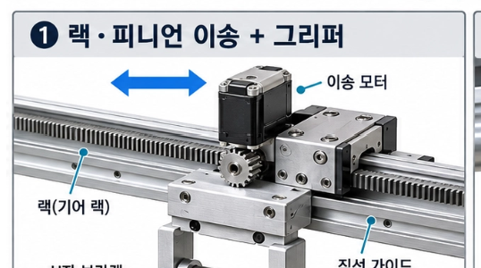

- 슬라이딩은 전력으로 구동하는 방향이 언급되었다. 구체적인 구성은 추가 확인이 필요하다.
- 행거와 장치의 결합이 제대로 이루어졌는지 확인할 방법이 필요하다.
  - 옷걸이에 3D 어댑터를 추가하는 방안이 제안되었다.

### 3. 구동축 및 재진열 동작

- 일자형 행거에서 **구동축 하나로 구현할 수 있는지** 논의했다. 구체적인 동작 방식은 추가 확인이 필요하다.
- 옷걸이를 **위로 들어 올리는 방식**과 **아래로 회전시키는 방식**을 비교했다.
- 갈고리 형태와 두 개의 축을 사용하는 방안도 언급되었다.
- 세 개의 구동축을 사용하는 경우 다음 동작을 구현할 수 있다는 의견이 있었다.
  - 위로 이동
  - 바깥쪽으로 이동
  - 회전
- 수평 이동 후 목적지 행거에 옷걸이를 다시 거는 동작까지 고려해야 한다.

### 4. 원형 큐와 일자형 행거 비교

| 구분 | 제안 및 기대 효과 | 검토 사항 |
| --- | --- | --- |
| **원형 행거 큐** | 재진열 동작을 간소화하기 위해 제안 | 회전 반지름, 전체 부피, 코너 부분의 의류 병목 가능성 |
| **일자형 행거** | 행거 위에서 수평으로 이동하는 구조 제안 | 행거 봉과 옷걸이의 걸림, 코너 구간의 이동, 동작 간소화 가능성 |

- 이동 전에 미리 스캔한 후 원형 큐를 구동하는 구조가 제안되었다.
- 간격을 넓히는 부분의 구체적인 구조는 추가 정리가 필요하다.
- 일자형 구조로도 기능을 충분히 간소화할 수 있다면, 원형 큐 대신 적용하는 방안을 검토한다.

### 5. 레일 및 지지 구조

- 공중에 떠 있는 형태의 레일 구조가 논의되었다.
- 원형 큐에서 옷걸이를 빼낼 때 필요한 이동 거리를 고려해 도킹 위치와 거리를 정해야 한다.
- **구조 설계 시 검토 사항**
  - 레일과 의류 하중을 버틸 지지대
  - 바닥을 지지하는 면적과 안정성
  - 외부 기어 부분의 안전 커버
  - 전체 장치의 부피
- 로봇의 부피 문제와 관련해 **ZARA와 같은 대형 매장**을 타깃으로 하는 방향이 언급되었다.
- 창살 수를 늘리기 위한 나선형 구조가 제안되었다.
  - 의류 간격과 겹침을 고려해야 한다.
  - 옷걸이를 하나씩 끝부분에 거는 방식이 언급되었으며, 구체적인 동작은 추가 확인이 필요하다.

### 6. 행거의 전원 및 하중

- 행거 자체에는 모터와 배터리를 넣지 않는 방향이 제안되었다.
- 행거 매핑용 장치에는 배터리가 필요할 수 있지만, 행거 자체에 배터리를 넣으면 하중이 증가한다는 우려가 있었다.

### 7. 로봇팔 적용 검토

- 로봇팔에 추가 기능을 넣자는 외부의 제안이 있어 논의했다.
- 다만 회전축이 많아지면 제어가 복잡해지고 예산 부담이 커질 수 있다.
- 관절에 걸리는 하중도 주요 검토 사항으로 언급되었다.

### 8. 동작 중 고정 및 안정성

- 대학원생의 의견으로, 운반 중인 행거를 잡는 구조뿐 아니라 **목적지 행거를 고정하는 구조**도 필요하다는 논의가 있었다.
- 필요에 따라 잡는 시퀀스를 추가해야 할 수 있다.
- 재진열 중 로봇이 움직이지 않도록 바퀴를 잠그거나 본체를 고정하는 방안이 제안되었다.
- 의류를 가르는 힘과 푸시 힘이 주요 변수이므로, 고정 구조와 함께 검토한다.

### 9. 후속 확인 사항

- 원형 큐와 일자형 행거 중 동작을 더 단순하게 구현할 수 있는 구조
- 구동축 1개·2개·3개 방식의 실제 동작 시퀀스
- 그리퍼 펼침 범위와 결합 확인 방법
- 의류를 벌리는 장치의 설치 위치
- 일자형·ㄱ자형 매대에서의 걸림 및 의류 낙하 여부
- 레일 지지대의 하중, 바닥 지지 면적, 전체 부피
- 재진열 중 로봇과 목적지 행거의 고정 방법

### 10. 다음 회의까지 할 일 및 목표

**다음 회의까지 할 일**

- 구동축 수에 따른 인출·재진열 동작 순서 구체화
- 그리퍼 펼침 범위, 결합 확인 방법 및 의류를 벌리는 장치 위치 검토
- 레일 지지 구조, 편중 하중, 전체 부피와 고정 방법 확인
- 착수 보고서에 포함할 기능 실험 항목 정리

**다음 회의 목표**

- 비교 결과를 바탕으로 우선 구현할 구조 선정
- 파지·인출·이송·재진열 동작과 필요한 구동축 결정
- 기능 실험 방법 및 평가 기준 구체화
- 세부적인 부품 재선정

---

## 3. 2차 회의 (10.08) 해야 할 일

### 1. 적당한 홈

- 옷을 걸 수 있는데, 그리퍼로 집어서 빼기 쉬운 홈

### 2. 일직선 → 회전까지 가능한 구조 및 방법 (그리퍼 회전)

- 락이 걸렸다가, 당기면 착 풀리는 형태

### 3. 옷걸이를 잡는 그리퍼의 형태 → 구조를 만들어서 실험 (힘, 무게, 토크)

- 그리퍼의 무게, 전력
- 구조 - 종류가 다양함
- 옷걸이 형태에 맞게 + 잡기 쉽게
- 옆 부분을 잡는 거니까 마찰력 → 그리퍼 끝부분에 고무(오돌토돌)
- **꽃받침 형태가 1순위**
  - 다른 형태가 있어도 괜찮음

---

## 4. 회의 준비 자료

### 1. 1차 회의 (10.06)

#### 1-1. 구조 정리본

**목표**: 탈의실에서 사용자가 벗은 옷을 대기 행거에 걸어두면, 이동 로봇이 해당 행거와 결합하여 옷을 수거하고 내부에 보관한 뒤 다음 탈의실로 이동하는 구조를 설계한다. 옷걸이 자체의 규격화는 최소화하고, 대학생 캡스톤 수준에서 모터 수와 제작 비용을 줄이는 것을 우선한다.

##### 1. 현재 검토 중인 전체 구조

- **로봇 본체 한쪽에 행거 모듈을 배치**하여 전체 폭과 부피를 줄이는 방향을 검토한다.
- 로봇 내부에서는 의류를 종류별로 분류하지 않고 **수거한 옷을 보관·정렬하는 역할만 수행**한다.
- 행거는 원형 또는 달팽이형 경로를 이용하여 제한된 공간에 여러 벌을 저장하는 방안을 검토한다.
- 옷이 실제로 걸린 상태이므로 옷걸이만 이동 가능한지를 기준으로 판단하지 않고, **의류의 폭·길이·무게와 옷끼리의 간섭**을 함께 고려한다.

##### 2. 달팽이형 행거 아이디어

**목적**: 원형 저장 구조에서 옷들이 한 지점에 겹치는 문제를 줄이고, 옷걸이의 위치를 일정한 순서로 유지하기 위한 구조.

- 달팽이형 경로를 따라 옷걸이를 순차적으로 배치한다.
- 로봇 상부에 슬라이딩 가능한 레일 또는 이송 장치를 두어 옷걸이를 필요한 위치로 이동시키는 방안을 검토한다.
- 옷걸이 이동 방법 후보
  - 슬라이딩/푸시 방식
  - 후크 또는 포크를 이용한 이송
  - 그리퍼를 이용한 이송
- 단, 다축 로봇팔이나 회전축이 추가될수록 모터 수와 제어 난도가 증가하므로 최소 구동축 구조를 우선 검토한다.

##### 3. 옷걸이 파지·이송 방식 후보

옷의 몸통을 직접 잡기보다 **옷걸이 고리 또는 목 부분을 이용하여 의류가 자연스럽게 아래로 늘어진 상태를 유지**하는 방향을 우선한다.

1. **고리 아래 받침형**: 옷걸이 고리 아래로 받침이 진입하여 들어 올리는 방식. 별도의 집게 개폐가 없어 구조가 단순하다.
2. **U/V자 포크형**: 포크가 옷걸이 고리 또는 목 부분을 받아 들어 올리는 방식. V자 형상을 이용하면 위치 오차를 기계적으로 중앙 정렬할 수 있다.
3. **목 부분 그리퍼형**: 옷걸이 목 부분을 양쪽에서 잡는 방식. 고정은 안정적이지만 그리퍼 개폐 및 이동축이 추가될 수 있다.

##### 4. 옷걸이 위치 인식 및 RFID (2안 관련)

옷걸이를 특정 규격으로 제한하기보다 **행거 구조가 옷걸이 위치를 정렬하도록 만드는 방향**을 우선 검토한다.

- 행거에 얕은 **홈 또는 슬롯**을 두어 옷걸이가 일정 위치에 머물도록 한다.
- 각 위치에 스위치를 두면 **옷걸이 존재 여부**를 확인할 수 있다.
- RFID를 이용해 **각 옷 또는 옷걸이의 ID**를 인식하는 방안을 검토한다.
- 역할을 분리하면 다음과 같다.
  - 홈/슬롯 → 위치 정렬
  - 스위치 → 점유 여부 확인
  - RFID → 개별 ID 확인

##### 5. 원형 행거 구동 및 도킹

- 원형 행거 중앙은 대기 행거와의 도킹 또는 구조물 결합에 사용될 가능성이 있어 **중앙 모터 배치는 지양**한다.
- 회전축 중앙에는 베어링을 배치하고, 외곽에서 **랙-피니언 등의 방식으로 회전력을 전달하는 구조**를 검토한다.
- 도킹 위치에는 모터가 직접 간섭하지 않도록 구조를 분리한다.
- 달팽이형일 때 고려해야 할 점: 달팽이의 가장 튀어나온 끝까지 양쪽에서 잡으려고 하면, 로봇 구조까지 이 폭을 따라가야 한다.

**외주 톱니 방식**

- **내용**: 원형 행거의 **외곽 전체 또는 일부를 큰 기어처럼 만들고**, 로봇에 작은 피니언을 달아서 회전시킴
- **장점**: 행거를 떼면 로봇에는 작은 피니언만 남는다. 즉 **교환 가능한 행거와 구동 모터를 분리**할 수 있다.
- **고려사항**: 작은 피니언 하나가 **옷이 잔뜩 걸린** 행거를 실제로 돌릴 수 있느냐
- ⇒ **해결 방법**: 핵심은 **하중과 구동을 분리하는 것**
  - 옷 + 행거가 예를 들어 **20 kg**이라고 해도 그 20 kg을 베어링/롤러가 받으면, 모터가 극복해야 하는 건 20 kg 자체가 아니라 주로 **베어링 마찰 + 롤러 마찰 + 회전 가속 + 무게 불균형**
  - 우리는 행거를 빠르게 돌릴 이유도 없으니까 **고속·저토크가 아니라 저속·고토크 감속모터**
- 하지만 달팽이형에서 생기는 또 다른 문제: **무게가 대칭이지 않다.**

| 구조 | 행거 지지 | 회전 | 교환 | 로봇 사이즈에 영향 |
| --- | --- | --- | --- | --- |
| **① 중앙 허브 + 외주기어** | 중앙 베어링 | 외곽 피니언 | 중앙 허브 분리 | **작음** |
| **② 외주 롤러 + 외주기어** | 원 둘레 2~3점 | 외곽 피니언 | 옆으로 빼냄 | 중간 |
| **③ 양끝 지지** | 행거 양끝 | 중앙/외곽 구동 | 양끝 해제 | **큼** |

##### 6. 대기 행거 교환 문제

로봇이 탈의실에 도착했을 때 이미 이전에 수거한 옷이 걸린 행거를 가지고 있으므로, **새로운 대기 행거를 장착하기 전에 기존 행거를 어디에 둘 것인지가 핵심 설계 문제**이다.

현재 검토 가능한 방향은 다음과 같다.

- 탈의실 측에 **반납용 빈 슬롯 + 수거용 대기 행거 슬롯**을 두고 기존 행거를 먼저 반납한 후 새로운 행거를 수거
- 행거 전체를 탈착 가능한 모듈로 구성하여 봉 또는 행거 모듈 자체를 교환

---

#### 1-2. 구조 스케치

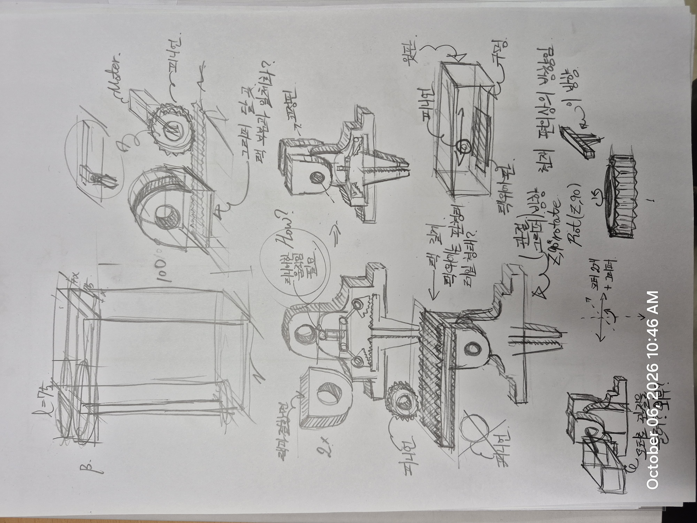

---

#### 1-3. 수거 방식 및 파지부·원형 행거 구조

##### 1. 먼저 결정할 수거 방식

| 방식 | 동작 | 필요한 구조 |
| --- | --- | --- |
| **옷만 이송** | 대기 행거에서 옷걸이를 한 벌씩 가져와 로봇 내장 행거에 보관 | 옷걸이 파지·이송 장치 |
| **행거 모듈 교환** | 옷이 걸린 행거 전체를 로봇에 결합 | 모듈 결합·분리 장치, 기존 모듈을 둘 공간 |
| **바퀴 달린 행거 견인** | 로봇이 행거를 연결해 끌고 이동 | 견인 연결부, 후진·회전 시 행거 움직임 고려 |

- **대기 행거에서 옷만 옮기는 건지, 행거 전체를 가져오는 건지**
- 바퀴 달린 행거를 끌면 후진·회전할 때 검토 필요

**결정할 순서**: 수거 방식 → 상부·하부 구동 → 팔 배치 → 어댑터·파지부 → 인출·재진열 경로. 착수 레포트의 테스트 기능

##### 2. 옷걸이 파지부 절충안

1. 기성 옷걸이는 그대로 두고, 목 부분에 끼우는 3D 프린팅 어댑터
2. 하부 턱이 있는 어댑터를 받침으로 지지하고, 집게로 이탈을 막는 방식 제안
   - 후크와 봉을 피해 옷걸이 목을 잡아야 하기에 제안

| 어댑터 1 | 어댑터 2 |
| --- | --- |
| 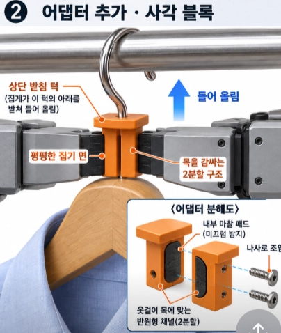 | 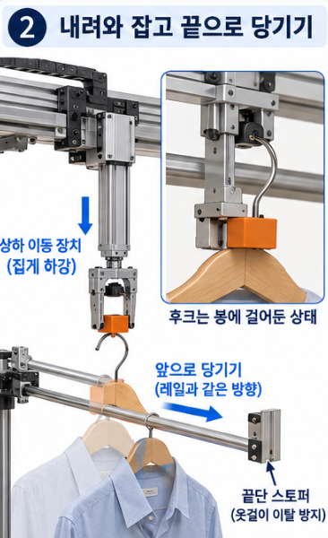 |

##### 3. 갈고리형 그리퍼와 슬라이딩 이송 동작

##### 4. 랙 피니언 구조형 그리퍼 + 어댑터

| 부분 | 모양 |
| --- | --- |
| **집게가 잡는 부분** | 양옆이 평평한 사각 블록. 둥근 모양보다 잡는 방향이 일정해짐 |
| **아래쪽 받침 턱** | 블록 아래를 조금 넓게 만들어 집게가 턱 아래를 받치도록 구성. 들어 올릴 때 마찰에만 의존하는 부담을 줄임 |
| **모서리** | 둥글게 처리해 옷깃에 걸리는 것을 줄임 |

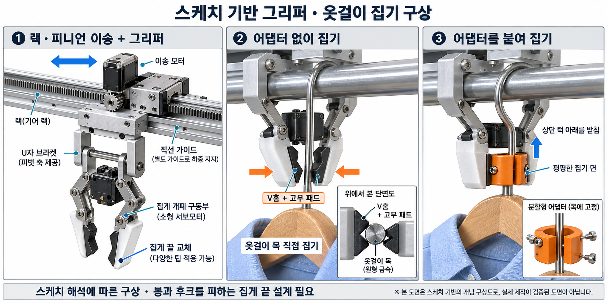

##### 5. 외주 모터 위치(상부/하부)에 따른 원형 행거 구조

**상부 구동 제안 — ex. 원형 회전문 구조 착안**

- 중앙 기둥 하나로 원형 큐를 지지한다.
- 기둥 꼭대기에 베어링과 회전 허브를 배치한다.
- 모터는 허브 옆의 고정 브래킷에 설치한다.
- 모터·기어는 커버로 감싸고, 이송 팔은 본체 가장자리에 고정한다.
- 옷과 행거의 하중은 지지 구조가 받도록 한다.

**상부 모터 + 갈고리형 그리퍼 동작** (행거 교체형, 고려 X)

| 동작 1 | 동작 2 |
| --- | --- |
| 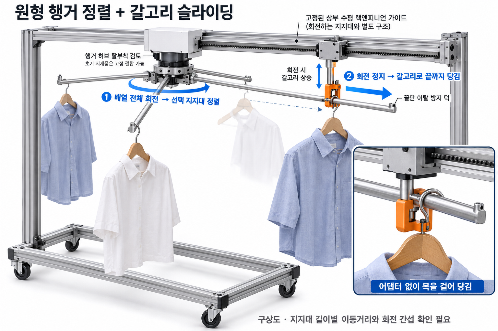 | 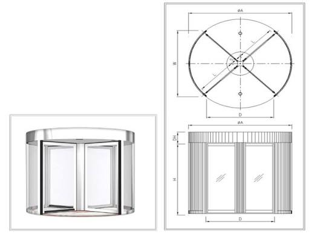 |

**하부 모터**

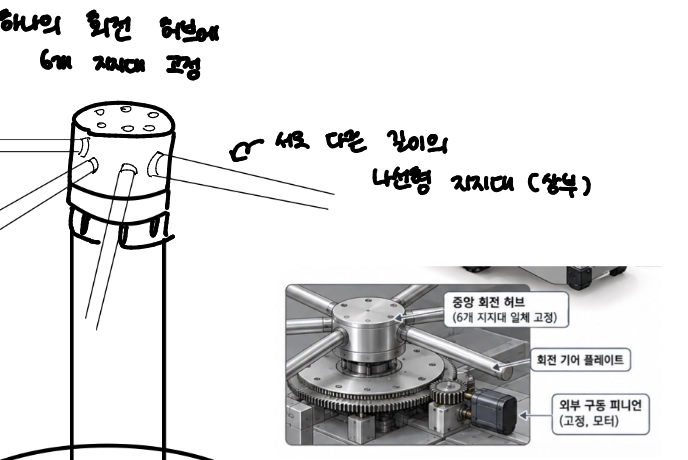

##### 6. 보조 슬라이딩 푸셔 후보

**옷걸이가 지지대 안쪽에 있고 끝으로 이동시켜야 할 때** 적용한다. 처음부터 끝단에 한 벌씩 걸려 있다면 별도 푸셔가 필요하지 않을 수 있다.

| 방법 | 작동 방식 | 고려할 점 |
| --- | --- | --- |
| **로봇팔이 직접 끝으로 당기기** | 팔이 옷걸이를 잡고 지지대를 따라 미끄러뜨린 다음 들어 올림 | 추가 푸셔 모터가 필요 없음. 팔이 안쪽 옷걸이까지 닿아야 함 |
| **공용 푸셔 1개** | 회전 큐가 멈추면 고정된 푸셔가 선택한 지지대에 접근해 밀어줌 | 지지대 길이가 다르면 접근 거리와 스트로크를 맞춰야 함 |
| **지지대를 바깥쪽으로 기울이기** | 중력으로 옷걸이를 끝단 스토퍼까지 이동시킴 | 마찰·옷 무게에 따라 안 내려오거나 여러 벌이 몰릴 수 있음 |

##### 7. 착수 레포트에 넣으면 좋을 테스트 기능

| 항목 | 확인 내용 |
| --- | --- |
| **회전 위치 정렬** | 대상 옷을 이송 위치로 가져왔을 때 정지 오차 |
| **편중 적재** | 한쪽 적재 시 지지대 처짐·허브 기울어짐·기어 맞물림 |
| **팔의 접근 범위** | 가장 짧은 지지대와 가장 긴 지지대의 옷 파지 |
| **파지 안정성** | 실제 옷 무게를 지지하면서 낙하·회전·어댑터 이탈 방지 |
| **인출·재진열** | 후크가 봉을 빠져나와 목적지에 걸리는 경로와 성공률 |
| **옷걸림** | 회전·인출 중 옷, 지지대, 팔 사이의 간섭 |
| **삽입 공간 확보** | 기존 옷 사이에 새 옷을 넣을 틈 형성 |
| **작업용 도킹** | 결합 후 거리·방향 유지와 이송 가능 여부 |

##### 8. 나선형 원형 행거 구조의 확인 사항

① 무게가 대칭이 아닌 문제점

- 긴 지지대가 아래로 처지는지
- 중앙 지지부가 기울어지거나 흔들리는지
- 회전하면서 기어 맞물림이 틀어지는지

② 옷마다 집는 거리가 다른 점

- 가장 짧은 지지대의 옷까지 이송 장치가 닿는가?
- 그 옷을 꺼내는 동안 다른 옷·지지대를 건드리지 않는가?
- 한쪽에만 옷이 걸려 있어도 지지부와 로봇이 안정적인가?

##### 9. 이송 장치가 옷걸이를 매장 행거에 어떻게 걸지

후크가 봉을 실제로 빠져나오는 높이와 경로는 모형으로 확인

| 기능 | 확인할 결과 |
| --- | --- |
| 옷걸이 파지·지지 | 옷이 걸린 상태에서 낙하·회전 없이 유지 |
| 상하·수평 이송 | 기존 봉에서 인출해 목적지까지 이동 |
| 재진열·장치 이탈 | 목적지 봉에 걸고 포크가 간섭 없이 후퇴 |
| 삽입 공간 확보 | 기존 옷 사이에 재진열 가능한 틈 형성 |

##### 10. 로봇팔 끝 장치: V자 포크를 쓰는 안 / 받침에 집게를 추가하는 안

| 후보 | 기대하는 장점 | 확인할 문제 |
| --- | --- | --- |
| **U자 받침** | 넓은 면으로 받칠 수 있음 | 옷걸이가 좌우로 흔들리거나 돌아가는지 |
| **V자 받침** | 접촉 형상에 따라 중앙으로 유도 가능 | 목 아래에 잘 맞는지, 옷감을 끼우는지 |
| **목 부분 그리퍼** | 잡은 자세를 유지하기 유리할 수 있음 | 개폐 장치와 파지력 제어가 필요 |

---

#### 1-4. 프로토타입 시뮬레이터

| 시뮬레이터 | 실행 | 파일 |
| --- | --- | --- |
| PRADA_Prototype_Simulator | [실행](https://htmlpreview.github.io/?https://github.com/SSangWonPark/Capstone_Design/blob/main/docs/meetings/assets/2026-10-06/prada-prototype-simulator.html) | [prada-prototype-simulator.html](assets/2026-10-06/prada-prototype-simulator.html) |

---

### 2. 2차 회의 (10.08)

#### 2-1. 그리퍼 형태 및 옷 벌리기

- 기존 구조에서 좀 더 생각 정리
- **그리퍼**: 목을 단순히 마찰로 집으면 곡선에서 옷걸이가 돌아갈 수 있으니, 목을 받쳐주는 홈과 회전을 막는 접촉부를 함께 두는 형태

| 시뮬레이터 | 실행 | 파일 |
| --- | --- | --- |
| PRADA_Trolley_Simulator | [실행](https://htmlpreview.github.io/?https://github.com/SSangWonPark/Capstone_Design/blob/main/docs/meetings/assets/2026-10-08/prada-trolley-simulator.html) | [prada-trolley-simulator.html](assets/2026-10-08/prada-trolley-simulator.html) |

- **옷 벌리기 아이디어** (애초에 옷 집는 것의 안정성도 같이 챙긴다면?)

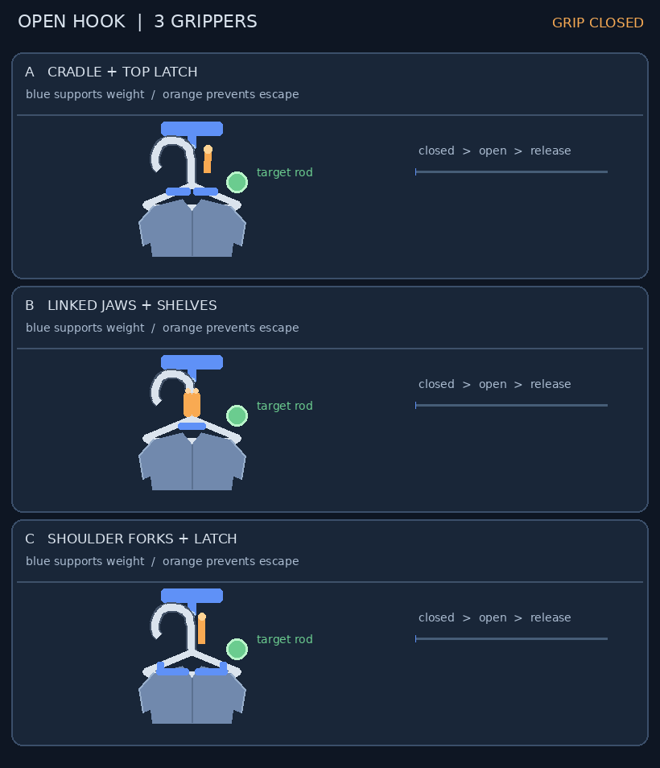

---

#### 2-2. 원형 행거 고정 및 지지대

| 시뮬레이터 | 실행 | 파일 |
| --- | --- | --- |
| PRADA_Prototype_Simulator_v7 | [실행](https://htmlpreview.github.io/?https://github.com/SSangWonPark/Capstone_Design/blob/main/docs/meetings/assets/2026-10-08/prada-prototype-simulator-v7.html) | [prada-prototype-simulator-v7.html](assets/2026-10-08/prada-prototype-simulator-v7.html) |

- 원형 행거 하부 고정 형태 (ex. 지게차 리프팅)
  - 행거 바퀴 부분을 잡을 수 있게
  - 잠금 장치 - 주행 안정성
- 원형 행거 회전 모터는 상부에 - 센터 맞추기 좋음
  - 지지대와 봉은 탈부착형
- 지지대의 개수
  - 중력에 의한 슬라이딩 형식 (+홈)
  - 홈에서 빠져나올 때 → 둥근 라운드의 홈

→ 착수 레포트에 쓸 기능

| 시뮬레이터 | 실행 | 파일 |
| --- | --- | --- |
| PRADA_Prototype_Simulator_v9 | [실행](https://htmlpreview.github.io/?https://github.com/SSangWonPark/Capstone_Design/blob/main/docs/meetings/assets/2026-10-08/prada-prototype-simulator-v9-1.html) | [prada-prototype-simulator-v9-1.html](assets/2026-10-08/prada-prototype-simulator-v9-1.html) |

- 위에서 벌리는 모습: 행거 위쪽이 막혀 있는 경우

---

#### 2-3. 그리퍼 어댑터 및 옷 벌림 구조

- 시뮬레이션 중간에 토큰이 다 소진되었다.

**1. 옷걸이 그리퍼 맞춤 어댑터를 단다**

| 어댑터 1 | 어댑터 2 |
| --- | --- |
| 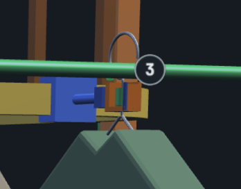 | 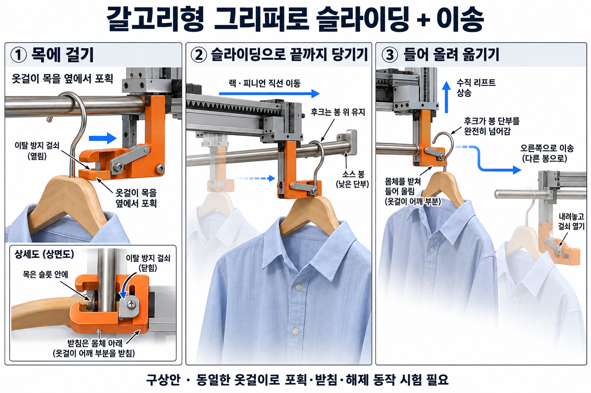 |

**2-1.** 끝이 둥글고 뒤로 갈수록 넓어지는 고정 쐐기(사진을 가로로 눕힘) + 직선 왕복 운동

**2-2.** 벌림용 모터 1개로 두 핑거를 좌우로 움직이는 모양 (핑거 벌림 사진은 잘못 생성됨)

| 2-1 | 2-2 |
| --- | --- |
| 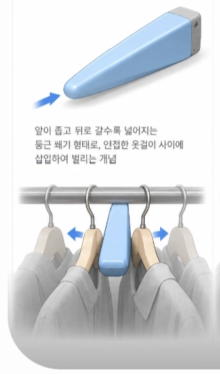 | 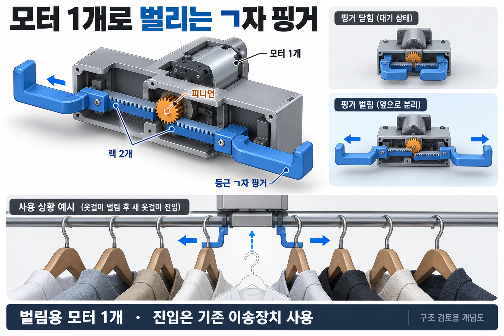 |

| 시뮬레이터 | 실행 | 파일 |
| --- | --- | --- |
| PRADA_Prototype_Simulator_gripper_split | [실행](https://htmlpreview.github.io/?https://github.com/SSangWonPark/Capstone_Design/blob/main/docs/meetings/assets/2026-10-08/prada-prototype-simulator-gripper-split.html) | [prada-prototype-simulator-gripper-split.html](assets/2026-10-08/prada-prototype-simulator-gripper-split.html) |

---

#### 2-4. 레일 설계 및 그리퍼 구조

| 시뮬레이터 | 실행 | 파일 |
| --- | --- | --- |
| PRADA_Prototype_Simulator_V9 | [실행](https://htmlpreview.github.io/?https://github.com/SSangWonPark/Capstone_Design/blob/main/docs/meetings/assets/2026-10-08/prada-prototype-simulator-v9-2.html) | [prada-prototype-simulator-v9-2.html](assets/2026-10-08/prada-prototype-simulator-v9-2.html) |

① 주행 중 후진 문제

- 하부 원형 행거 도킹으로 후진 문제를 해결할 수 있는지 검토한다.

② ㄱ자형 매대에 거는 문제

- 구조를 다시 검토해야 한다.
- 그리퍼가 옷걸이 목을 치면서 거는 방식은 모터 파워에 따라 결과가 달라진다.

③ 경첩 텐션으로 90° → 180° 펼치는 동작

- 스프링으로 텐션을 주는 방식과 축의 고정 방법은 추가 조사가 필요하다.
- 락이 걸리면서 회전하는 형태를 검토한다.

④ 레일(이동 경로) 설계

- 회전축이 있는 점을 고려한다.
- 컨베이어 벨트(노란색)를 궤도 형태로 구성한다.
- 레일의 지지대는 로봇의 옆면을 활용해도 괜찮다.

| 구분 | 안 1 (노란색 = 파란색) | 안 2 (노란색 ≠ 파란색) |
| --- | --- | --- |
| 구성 | 메인 프레임(고정) + 벨트 | 벨트 + 하부 지지대 |
| 그리퍼 지지 | 벨트에 그리퍼, 위에 지지대 | 벨트에 그리퍼, 하부 지지대가 슬라이드를 따라 이동 |
| 하중 | 벨트가 하중을 견딜 수 있는지 확인 필요 | 벨트는 레일을 움직일 동력만 제공하므로 그리퍼 하중 문제 해결 |
| 비고 | - | DC단 |

⑤ RFID 인식 및 진열 순서

- RFID 인식 → 옷 갈라 공간 확보 → 진열 순으로 동작한다.
- RFID 인식 시점은 그리퍼로 잡았을 때와, 레일 중간에서 원형 행거로부터 거리를 두었을 때를 비교한다.
- RFID 인식 위치는 네모 박스 구간으로 한다.

⑥ 원형 행거 고정 형태

- 사각형과 원형 중 **원형**으로 한다.
- 원형은 어느 위치에서 행거를 잡아도 상관없기 때문이다.

⑦ 옷걸이를 잡는 그리퍼의 형태

구조를 직접 만들어 실험한다.

- 그리퍼의 무게, 전력
- 구조의 종류가 다양함
- 옷걸이 형태에 맞으면서 잡기 쉬운 형태
- 옆 부분을 잡으므로 마찰력이 중요함 → 그리퍼 끝부분에 오돌토돌한 고무 부착

⑧ 그리퍼 후보

| 후보 | 내용 | 확인할 점 |
| --- | --- | --- |
| **U자형 + 리니어 모터** | 리니어 모터는 힘이 좋아, 그리퍼 회전 구조를 해결할 수 있다면 가장 적합 | 끝 쪽에서 회전하고 다시 돌아오는 구조 (예: 끝 쪽에 장력·고무줄을 주어 끝까지 갔다가 풀리면 복귀) |
| **삼각형** | 펼치는 동작부터 시작하는 그리퍼 형태 | 모터 2개 필요 |

⑨ 추가 검토 사항

- 전체 설계를 어떻게 진행할지 정해야 한다.

---